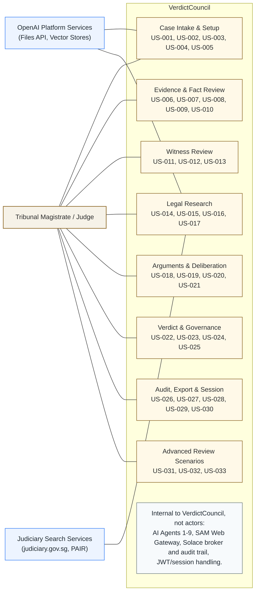
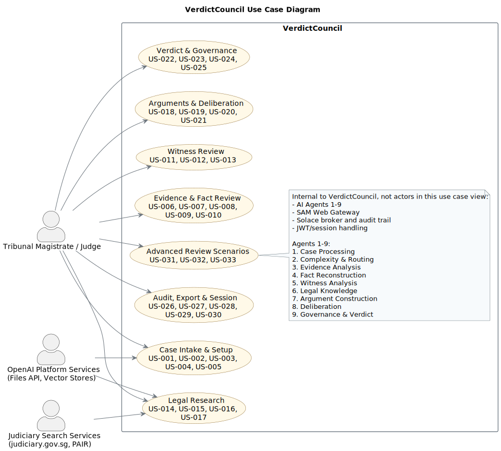

# VerdictCouncil Use Case Diagrams

This folder keeps the editable diagram sources and a GitHub-friendly view of the same content.

- Mermaid source: [`verdictcouncil_use_case.mmd`](./verdictcouncil_use_case.mmd)
- PlantUML source: [`verdictcouncil_use_case.puml`](./verdictcouncil_use_case.puml)
- PlantUML render: [`verdictcouncil_use_case.svg`](./verdictcouncil_use_case.svg)

## Modeling Choices

- Actors are limited to external roles and external systems at the VerdictCouncil boundary.
- The 9 AI agents are internal implementation and orchestration components, so they are not modeled as actors in this use case diagram.
- The user stories are grouped into higher-level judge-facing capabilities to keep the diagram readable while still referencing every `US-*` item from the architecture document.

## Mermaid

GitHub renders Mermaid diagrams directly from Markdown, so the diagram is embedded here for visibility.

## PlantUML

The PlantUML source is kept separately and rendered to SVG for GitHub display.

