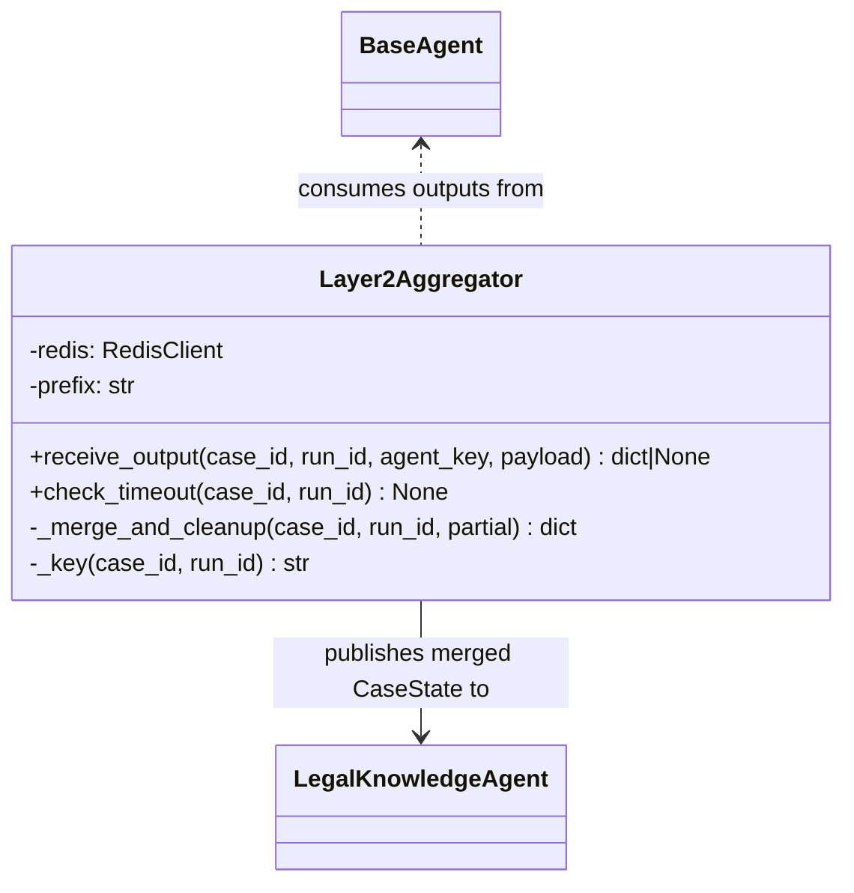

# Part 5: Diagrams

## 5.1 Entity-Relationship Diagram

```mermaid
erDiagram
    users {
        uuid id PK
        varchar name
        varchar email UK
        enum role "judge | admin | clerk"
        varchar password_hash
        timestamp created_at
        timestamp updated_at
    }

    sessions {
        uuid id PK
        uuid user_id FK
        varchar jwt_token_hash
        timestamp expires_at
        timestamp created_at
    }

    cases {
        uuid id PK
        enum domain "small_claims | traffic_violation"
        enum status "pending | processing | ready_for_review | decided | rejected | escalated | closed | failed"
        boolean jurisdiction_valid
        enum complexity "low | medium | high"
        enum route "proceed_automated | proceed_with_review | escalate_human"
        uuid created_by FK
        timestamp created_at
        timestamp updated_at
    }

    parties {
        uuid id PK
        uuid case_id FK
        varchar name
        enum role "claimant | respondent | accused | prosecution"
        jsonb contact_info
    }

    documents {
        uuid id PK
        uuid case_id FK
        varchar openai_file_id
        varchar filename
        varchar file_type
        uuid uploaded_by FK
        timestamp uploaded_at
    }

    evidence {
        uuid id PK
        uuid case_id FK
        uuid document_id FK
        enum evidence_type "documentary | testimonial | physical | digital | expert"
        enum strength "strong | medium | weak"
        jsonb admissibility_flags
        jsonb linked_claims
    }

    facts {
        uuid id PK
        uuid case_id FK
        date event_date
        time event_time
        text description
        uuid source_document_id FK
        enum confidence "high | medium | low | disputed"
        enum status "agreed | disputed"
        jsonb corroboration
    }

    witnesses {
        uuid id PK
        uuid case_id FK
        varchar name
        varchar role
        uuid party_id FK
        int credibility_score
        jsonb bias_indicators
        text simulated_testimony
    }

    legal_rules {
        uuid id PK
        uuid case_id FK
        varchar statute_name
        varchar section
        text verbatim_text
        float relevance_score
        text application
    }

    precedents {
        uuid id PK
        uuid case_id FK
        varchar citation
        varchar court
        varchar outcome
        text reasoning_summary
        float similarity_score
        text distinguishing_factors
        enum source "curated | live_search"
        varchar url
    }

    arguments {
        uuid id PK
        uuid case_id FK
        enum side "prosecution | defense | claimant | respondent"
        text legal_basis
        jsonb supporting_evidence
        text weaknesses
        jsonb suggested_questions
    }

    deliberations {
        uuid id PK
        uuid case_id FK
        jsonb reasoning_chain
        text preliminary_conclusion
        jsonb uncertainty_flags
        int confidence_score
    }

    verdicts {
        uuid id PK
        uuid case_id FK
        enum recommendation_type "compensation | repair | dismiss | guilty | not_guilty | reduced"
        text recommended_outcome
        jsonb sentence
        int confidence_score
        jsonb alternative_outcomes
        jsonb fairness_report
    }

    audit_logs {
        uuid id PK
        uuid case_id FK
        varchar agent_name
        varchar action
        jsonb input_payload
        jsonb output_payload
        text system_prompt
        jsonb llm_response
        jsonb tool_calls
        varchar model
        jsonb token_usage
        varchar solace_message_id
        timestamp created_at
    }

    users ||--o{ sessions : "has"
    users ||--o{ cases : "creates"
    cases ||--o{ parties : "involves"
    cases ||--o{ documents : "contains"
    cases ||--o{ evidence : "has"
    documents ||--o{ evidence : "supports"
    cases ||--o{ facts : "establishes"
    documents ||--o{ facts : "sources"
    cases ||--o{ witnesses : "involves"
    parties ||--o{ witnesses : "associated_with"
    cases ||--o{ legal_rules : "applies"
    cases ||--o{ precedents : "references"
    cases ||--o{ arguments : "presents"
    cases ||--|| deliberations : "produces"
    cases ||--|| verdicts : "concludes_with"
    cases ||--o{ audit_logs : "tracks"
```



## 5.2 Sequence Diagram — Full Pipeline Flow

```mermaid
sequenceDiagram
    actor Judge
    participant WG as WebGateway
    participant SB as SolaceBroker
    participant PG as PostgreSQL
    participant OAI as OpenAI API
    participant CP as CaseProcessing
    participant CR as ComplexityRouting
    participant EA as EvidenceAnalysis
    participant FR as FactReconstruction
    participant WA as WitnessAnalysis
    participant LK as LegalKnowledge
    participant JAPI as JudiciaryAPI
    participant RD as Redis
    participant AC as ArgumentConstruction
    participant DL as Deliberation
    participant GV as GovernanceVerdict

    Note over Judge, GV: Phase 1 — Case Intake

    Judge ->>+ WG: POST /cases (upload documents)
    WG ->> OAI: Upload files (Files API)
    OAI -->> WG: file_ids[]
    WG ->> PG: INSERT case (status: PROCESSING)
    PG -->> WG: case_id
    WG -->> Judge: 202 Accepted (case_id)
    WG ->>- SB: Publish verdictcouncil/case_processing/{case_id}

    Note over SB, CP: Phase 2 — Case Processing

    SB ->>+ CP: Deliver message
    CP ->> OAI: parse_document (Files API per file)
    OAI -->> CP: Parsed document content
    CP ->> OAI: gpt-5.4-nano — classify domain, validate jurisdiction
    OAI -->> CP: domain, jurisdiction_valid, parties[]
    CP ->> PG: UPDATE case (domain, jurisdiction, parties)
    CP ->>- SB: Publish verdictcouncil/complexity_routing/{case_id}

    Note over SB, CR: Phase 3 — Complexity Routing

    SB ->>+ CR: Deliver message
    CR ->> OAI: gpt-5.4-nano (reasoning_effort: low) — assess complexity
    OAI -->> CR: complexity, route

    alt route = escalate_human
        CR ->> PG: UPDATE case (status: ESCALATED)
        CR ->> SB: Publish verdictcouncil/gateway/escalation/{case_id}
        SB ->> WG: Deliver escalation
        WG ->> Judge: Display escalation alert
    else route = proceed_automated OR proceed_with_review
        CR ->> PG: UPDATE case (complexity, route)
        CR ->>- SB: Publish verdictcouncil/evidence_analysis/{case_id}
    end

    Note over SB, WA: Phase 4-6 — Parallel Analysis (Layer 2)

    par Evidence Analysis
        SB ->>+ EA: Deliver message
        EA ->> OAI: parse_document (extract tables, OCR)
        OAI -->> EA: Structured content
        EA ->> OAI: gpt-5 — analyze evidence strength, admissibility
        OAI -->> EA: evidence[], cross_references[]
        EA ->> PG: INSERT evidence records
        EA ->>- SB: Publish to aggregator
    and Fact Reconstruction
        SB ->>+ FR: Deliver message
        FR ->> OAI: gpt-5 — extract facts, build timeline
        OAI -->> FR: facts[], timeline
        FR ->> OAI: cross_reference (consistency check)
        OAI -->> FR: contradictions[], corroborations[]
        FR ->> PG: INSERT facts records
        FR ->>- SB: Publish to aggregator
    and Witness Analysis
        SB ->>+ WA: Deliver message
        WA ->> OAI: gpt-5-mini — identify witnesses, assess credibility
        OAI -->> WA: witnesses[], credibility_scores[]
        WA ->> OAI: gpt-5-mini — simulate testimony, generate questions
        OAI -->> WA: simulated_testimony[], questions[]
        WA ->> PG: INSERT witness records
        WA ->>- SB: Publish to aggregator
    end

    Note over SB, LK: Layer2Aggregator — Fan-In Barrier

    SB ->> SB: Layer2Aggregator collects all 3 outputs
    SB ->> SB: Merge into unified CaseState (deep-copy original, update 3 fields)
    SB ->> SB: Publish to legal-knowledge topic

    Note over SB, LK: Phase 7 — Legal Knowledge

    SB ->>+ LK: Deliver message
    LK ->> OAI: file_search (vector store — statutes)
    OAI -->> LK: matching statutes[]
    LK ->> RD: Check precedent cache
    RD -->> LK: Cache miss
    LK ->> JAPI: search_precedents (PAIR API)
    JAPI -->> LK: searchResults[] (eLitigation corpus)
    LK ->> RD: Cache results (TTL: 24h)
    LK ->> OAI: gpt-5 — rank relevance, extract reasoning
    OAI -->> LK: legal_rules[], precedents[]
    LK ->> PG: INSERT legal_rules, precedents
    LK ->>- SB: Publish verdictcouncil/argument_construction/{case_id}

    Note over SB, AC: Phase 8 — Argument Construction

    SB ->>+ AC: Deliver message
    AC ->> OAI: gpt-5.4 — build prosecution/claimant arguments
    OAI -->> AC: prosecution_args
    AC ->> OAI: gpt-5.4 — build defense/respondent arguments
    OAI -->> AC: defense_args
    AC ->> OAI: gpt-5.4 — balanced assessment, generate questions
    OAI -->> AC: balanced_assessment, questions[]
    AC ->> PG: INSERT arguments (2 per case)
    AC ->>- SB: Publish verdictcouncil/deliberation/{case_id}

    Note over SB, DL: Phase 9 — Deliberation

    SB ->>+ DL: Deliver message
    DL ->> OAI: gpt-5.4 — synthesize reasoning chain
    OAI -->> DL: reasoning_chain[], preliminary_conclusion, uncertainty_flags[]
    DL ->> PG: INSERT deliberation
    DL ->>- SB: Publish verdictcouncil/governance_verdict/{case_id}

    Note over SB, GV: Phase 10 — Governance & Verdict

    SB ->>+ GV: Deliver message
    GV ->> OAI: gpt-5.4 — fairness audit (bias detection)
    OAI -->> GV: fairness_report

    alt critical_bias_detected
        GV ->> PG: UPDATE case (status: ESCALATED)
        GV ->> SB: Publish verdictcouncil/gateway/halt/{case_id}
        SB ->> WG: Deliver halt notification
        WG ->> Judge: Display bias alert — manual review required
    else audit_passes
        GV ->> OAI: confidence_calc (weighted scoring)
        OAI -->> GV: confidence_score
        GV ->> OAI: gpt-5.4 — generate final verdict recommendation
        OAI -->> GV: verdict_recommendation
        GV ->> SB: Publish verdictcouncil/gateway/verdict/{case_id}
    end

    SB ->> WG: Deliver verdict
    WG ->> PG: INSERT verdict + audit_logs
    WG ->> PG: UPDATE case (status: READY_FOR_REVIEW)
    WG ->>- Judge: Display verdict recommendation

    Note over Judge, GV: Phase 11 — Judicial Decision

    Judge ->>+ WG: POST /cases/{id}/decision (accept/modify/reject)
    WG ->> PG: UPDATE case (status: DECIDED, judge_decision)
    WG -->>- Judge: 200 OK — decision recorded
```

## 5.3 Physical Architecture Diagram

```mermaid
flowchart TB
    subgraph External["External Services"]
        OAI["OpenAI API<br/>api.openai.com"]
        PAIR["PAIR Search API<br/>search.pair.gov.sg"]
        ELIT["eLitigation<br/>elitigation.sg"]
    end

    subgraph K8s["Kubernetes Cluster — namespace: verdictcouncil"]
        ING["Ingress Controller<br/>NGINX"]

        subgraph Gateway["Gateway Layer"]
            WG["web-gateway pod<br/>SAM + FastAPI<br/>:8000"]
        end

        subgraph Broker["Message Broker"]
            SOL["solace-broker pod<br/>Solace PubSub+<br/>:55555 / :8080 / :1883 / :8008"]
        end

        subgraph Agents["Agent Pods (9)"]
            CP["case-processing"]
            CR["complexity-routing"]
            EA["evidence-analysis"]
            FR["fact-reconstruction"]
            WA["witness-analysis"]
            LK["legal-knowledge"]
            AC["argument-construction"]
            DL["deliberation"]
            GV["governance-verdict"]
        end

        subgraph Data["Data Layer (StatefulSets)"]
            PG["postgresql pod<br/>:5432<br/>PVC: 50Gi"]
            RD["redis pod<br/>:6379"]
        end

        subgraph Services["ClusterIP Services"]
            WGS["web-gateway-svc"]
            SOLS["solace-broker-svc"]
            PGS["postgresql-svc"]
            RDS["redis-svc"]
        end
    end

    %% Ingress
    ING -->|"HTTPS :443"| WGS
    WGS --> WG

    %% Gateway connections
    WG --> SOLS
    WG --> PGS

    %% Agent connections to broker
    CP --> SOLS
    CR --> SOLS
    EA --> SOLS
    FR --> SOLS
    WA --> SOLS
    LK --> SOLS
    AC --> SOLS
    DL --> SOLS
    GV --> SOLS

    %% Broker service
    SOLS --> SOL

    %% Agent connections to database
    CP --> PGS
    CR --> PGS
    EA --> PGS
    FR --> PGS
    WA --> PGS
    LK --> PGS
    AC --> PGS
    DL --> PGS
    GV --> PGS

    %% Database service
    PGS --> PG

    %% Redis
    LK --> RDS
    RDS --> RD

    %% External API connections
    CP -.->|"HTTPS"| OAI
    CR -.->|"HTTPS"| OAI
    EA -.->|"HTTPS"| OAI
    FR -.->|"HTTPS"| OAI
    WA -.->|"HTTPS"| OAI
    LK -.->|"HTTPS"| OAI
    AC -.->|"HTTPS"| OAI
    DL -.->|"HTTPS"| OAI
    GV -.->|"HTTPS"| OAI

    LK -.->|"HTTPS"| JUD
    LK -.->|"HTTPS"| PAIR
```



## 5.4 Class Diagram

```mermaid
classDiagram
    class BaseAgent {
        <<abstract>>
        #config: dict
        #broker_client: SolaceBrokerClient
        #db_session: Session
        +handle_message(payload: dict) dict
        +publish(topic: str, payload: dict) void
        +validate_output(result: dict, schema: dict) bool
        +log_audit(action: str, input_hash: str, output_hash: str) void
    }

    class CaseProcessingAgent {
        +parse_and_structure() DocumentContent
        +classify_domain() str
        +validate_jurisdiction() bool
    }

    class ComplexityRoutingAgent {
        +assess_complexity() str
        +determine_route() str
    }

    class EvidenceAnalysisAgent {
        +analyze_evidence() list~EvidenceItem~
        +cross_reference_documents() list~Finding~
    }

    class FactReconstructionAgent {
        +extract_facts() list~Fact~
        +build_timeline() Timeline
    }

    class WitnessAnalysisAgent {
        +identify_witnesses() list~Witness~
        +assess_credibility() list~int~
        +simulate_testimony() list~str~
    }

    class LegalKnowledgeAgent {
        +retrieve_statutes() list~LegalRule~
        +retrieve_precedents() list~Precedent~
        +search_live_precedents() list~Precedent~
    }

    class ArgumentConstructionAgent {
        +build_prosecution_args() Argument
        +build_defense_args() Argument
        +build_balanced_assessment() dict
    }

    class DeliberationAgent {
        +synthesize_reasoning_chain() list~ReasoningStep~
    }

    class GovernanceVerdictAgent {
        +run_fairness_audit() dict
        +generate_verdict() VerdictRecommendation
    }

    class ParseDocumentTool {
        +execute(file_id: str, extract_tables: bool, ocr_enabled: bool) DocumentContent
    }

    class CrossReferenceTool {
        +execute(segments: list, check_type: str) list~Finding~
    }

    class TimelineConstructTool {
        +execute(events: list~Fact~) Timeline
    }

    class GenerateQuestionsTool {
        +execute(argument_summary: str, weaknesses: str, question_types: list, max_questions: int) list~Question~
    }

    class ConfidenceCalcTool {
        +execute(evidence_scores: list, rule_relevance_scores: list, precedent_similarity_scores: list, witness_credibility_scores: list, weights: dict) float
    }

    class SearchPrecedentsTool {
        +execute(query: str, domain: str, max_results: int, date_range: dict) list~Precedent~
    }

    class CaseState {
        +case_id: str
        +domain: str
        +status: str
        +parties: list~Party~
        +case_metadata: dict
        +raw_documents: list~Document~
        +evidence_analysis: list~EvidenceItem~
        +extracted_facts: list~Fact~
        +witnesses: list~Witness~
        +legal_rules: list~LegalRule~
        +precedents: list~Precedent~
        +arguments: list~Argument~
        +deliberation: list~ReasoningStep~
        +fairness_check: dict
        +verdict_recommendation: VerdictRecommendation
        +judge_decision: dict
        +audit_log: list~AuditEntry~
    }

    class Party {
        +id: str
        +name: str
        +role: str
        +contact_info: dict
    }

    class Document {
        +id: str
        +openai_file_id: str
        +filename: str
        +file_type: str
    }

    class EvidenceItem {
        +id: str
        +document_id: str
        +evidence_type: str
        +strength: str
        +admissibility_flags: dict
        +linked_claims: list
    }

    class Fact {
        +id: str
        +date: str
        +time: str
        +description: str
        +source_doc_id: str
        +confidence: str
        +status: str
        +corroboration: dict
    }

    class Witness {
        +id: str
        +name: str
        +role: str
        +party_id: str
        +credibility_score: int
        +bias_indicators: dict
    }

    class LegalRule {
        +id: str
        +statute_name: str
        +section: str
        +verbatim_text: str
        +relevance_score: float
        +application: str
    }

    class Precedent {
        +id: str
        +citation: str
        +court: str
        +outcome: str
        +reasoning_summary: str
        +similarity_score: float
        +source: str
    }

    class Argument {
        +id: str
        +side: str
        +legal_basis: str
        +supporting_evidence: list
        +weaknesses: str
        +questions: list
    }

    class ReasoningStep {
        +step_number: int
        +category: str
        +content: str
        +source_agent: str
        +source_evidence: list
        +confidence: float
    }

    class VerdictRecommendation {
        +type: str
        +outcome: str
        +sentence: dict
        +confidence_score: int
        +alternatives: list
        +fairness_report: dict
    }

    class AuditEntry {
        +id: str
        +agent_name: str
        +action: str
        +input_hash: str
        +output_hash: str
        +tool_calls: list
        +timestamp: str
    }

    class CaseService {
        +create_case(data: dict) CaseState
        +get_case(case_id: str) CaseState
        +update_status(case_id: str, status: str) void
        +search_cases(filters: dict) list~CaseState~
        +add_documents(case_id: str, files: list) list~Document~
    }

    class AuditService {
        +log_action(entry: AuditEntry) void
        +get_audit_trail(case_id: str) list~AuditEntry~
        +get_case_audit(case_id: str, agent: str) list~AuditEntry~
    }

    class AuthService {
        +authenticate(email: str, password: str) dict
        +issue_token(user_id: str) str
        +validate_token(token: str) dict
        +revoke_token(token: str) void
    }

    class ExportService {
        +generate_pdf(case_id: str) bytes
        +generate_json(case_id: str) dict
    }

    %% Inheritance
    BaseAgent <|-- CaseProcessingAgent
    BaseAgent <|-- ComplexityRoutingAgent
    BaseAgent <|-- EvidenceAnalysisAgent
    BaseAgent <|-- FactReconstructionAgent
    BaseAgent <|-- WitnessAnalysisAgent
    BaseAgent <|-- LegalKnowledgeAgent
    BaseAgent <|-- ArgumentConstructionAgent
    BaseAgent <|-- DeliberationAgent
    BaseAgent <|-- GovernanceVerdictAgent

    %% Tool usage
    CaseProcessingAgent --> ParseDocumentTool : uses
    EvidenceAnalysisAgent --> ParseDocumentTool : uses
    EvidenceAnalysisAgent --> CrossReferenceTool : uses
    FactReconstructionAgent --> ParseDocumentTool : uses
    FactReconstructionAgent --> TimelineConstructTool : uses
    FactReconstructionAgent --> CrossReferenceTool : uses
    WitnessAnalysisAgent --> CrossReferenceTool : uses
    WitnessAnalysisAgent --> GenerateQuestionsTool : uses
    LegalKnowledgeAgent --> SearchPrecedentsTool : uses
    ArgumentConstructionAgent --> GenerateQuestionsTool : uses
    GovernanceVerdictAgent --> ConfidenceCalcTool : uses

    %% State usage
    CaseProcessingAgent ..> CaseState : reads/writes
    ComplexityRoutingAgent ..> CaseState : reads/writes
    EvidenceAnalysisAgent ..> CaseState : reads/writes
    FactReconstructionAgent ..> CaseState : reads/writes
    WitnessAnalysisAgent ..> CaseState : reads/writes
    LegalKnowledgeAgent ..> CaseState : reads/writes
    ArgumentConstructionAgent ..> CaseState : reads/writes
    DeliberationAgent ..> CaseState : reads/writes
    GovernanceVerdictAgent ..> CaseState : reads/writes

    %% Composition
    CaseState *-- Party
    CaseState *-- Document
    CaseState *-- EvidenceItem
    CaseState *-- Fact
    CaseState *-- Witness
    CaseState *-- LegalRule
    CaseState *-- Precedent
    CaseState *-- Argument
    CaseState *-- ReasoningStep
    CaseState *-- VerdictRecommendation
    CaseState *-- AuditEntry
```



---

## 5.5 Layer 2 Aggregator Class Diagram



---

