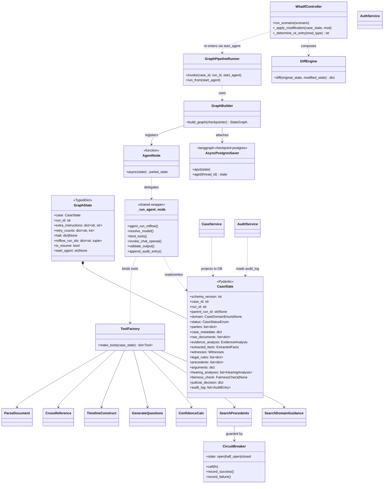

# Part 5: Diagrams

This part holds the diagrams that are stable enough to hand to a new engineer. The authoritative DB schema lives in `alembic/versions/`; the authoritative graph topology lives in `src/pipeline/graph/builder.py`. If this file disagrees with either, the code wins.

## 5.1 Entity-Relationship Diagram (logical view)

Only the load-bearing entities and their primary relationships are shown. Tables with only service-plumbing fields (`system_config`, `password_reset_tokens`, `sessions`) are omitted.

```mermaid
erDiagram
    users {
        uuid id PK
        varchar name
        varchar email UK
        enum role "user | judge | senior_judge | admin"
        varchar password_hash
        timestamp created_at
        timestamp updated_at
    }

    cases {
        uuid id PK
        enum domain "small_claims | traffic_violation"
        enum status "pending | processing | awaiting_review_gate1..4 | ready_for_review | escalated | closed | failed | failed_retryable"
        jsonb case_metadata
        uuid created_by FK
        timestamp created_at
        timestamp updated_at
    }

    parties {
        uuid id PK
        uuid case_id FK
        varchar name
        enum role "claimant | respondent | accused | prosecution"
        jsonb contact_info
    }

    documents {
        uuid id PK
        uuid case_id FK
        varchar openai_file_id
        varchar filename
        varchar file_type
        enum kind "notice_of_traffic_offence | charge_sheet | police_report | witness_statement | speed_camera_record | medical_report | letter_of_mitigation | evidence_bundle | other"
        jsonb pages
        uuid uploaded_by FK
        timestamp uploaded_at
    }

    evidence {
        uuid id PK
        uuid case_id FK
        uuid document_id FK
        enum evidence_type "documentary | testimonial | physical | digital | expert"
        enum strength "strong | medium | weak"
        jsonb admissibility_flags
        jsonb linked_claims
    }

    facts {
        uuid id PK
        uuid case_id FK
        date event_date
        time event_time
        text description
        uuid source_document_id FK
        enum confidence "high | medium | low | disputed"
        enum status "agreed | disputed"
        jsonb corroboration
    }

    witnesses {
        uuid id PK
        uuid case_id FK
        varchar name
        varchar role
        uuid party_id FK
        int credibility_score
        jsonb bias_indicators
    }

    legal_rules {
        uuid id PK
        uuid case_id FK
        varchar statute_ref
        varchar section
        text verbatim_text
        float relevance_score
        text application_to_facts
    }

    precedents {
        uuid id PK
        uuid case_id FK
        varchar citation
        varchar court
        varchar outcome
        text reasoning_summary
        float similarity_score
        text distinguishing_factors
        enum source "curated | live_search"
    }

    arguments {
        uuid id PK
        uuid case_id FK
        enum side "prosecution | defense | claimant | respondent"
        text legal_basis
        jsonb supporting_evidence
        text weaknesses
        jsonb judicial_questions
    }

    hearing_analyses {
        uuid id PK
        uuid case_id FK
        text preliminary_conclusion
        int confidence_score
        jsonb reasoning_chain
        jsonb uncertainty_flags
        timestamp created_at
        timestamp updated_at
    }

    hearing_notes {
        uuid id PK
        uuid case_id FK
        uuid judge_id FK
        text content
        varchar section_reference
        varchar note_type
        boolean is_locked
        timestamp created_at
        timestamp updated_at
    }

    what_if_scenarios {
        uuid id PK
        uuid case_id FK
        uuid parent_run_id FK
        varchar modification_type
        jsonb modification_payload
        enum status "pending | running | completed | failed"
        timestamp created_at
    }

    what_if_results {
        uuid id PK
        uuid scenario_id FK
        jsonb modified_verdict
        jsonb diff_view
        float stability_score
        timestamp completed_at
    }

    pipeline_checkpoints {
        uuid id PK
        uuid case_id FK
        uuid run_id
        jsonb checkpoint_blob
        int schema_version
        timestamp created_at
    }

    pipeline_jobs {
        uuid id PK
        uuid case_id FK
        varchar job_type
        enum status "queued | dispatched | running | completed | failed"
        int attempts
        timestamp claimed_at
        timestamp completed_at
    }

    domains {
        uuid id PK
        varchar name
        varchar jurisdiction_code
        varchar vector_store_id
        uuid created_by FK
        timestamp created_at
    }

    domain_documents {
        uuid id PK
        uuid domain_id FK
        varchar openai_file_id
        varchar filename
        enum status "pending | active | retired | rejected"
        timestamp uploaded_at
    }

    audit_logs {
        uuid id PK
        uuid case_id FK
        varchar agent_name
        varchar action
        jsonb input_payload
        jsonb output_payload
        text system_prompt
        jsonb llm_response
        jsonb tool_calls
        varchar model
        jsonb token_usage
        timestamp created_at
    }

    users ||--o{ cases : creates
    users ||--o{ hearing_notes : authors
    cases ||--o{ parties : involves
    cases ||--o{ documents : contains
    cases ||--o{ evidence : has
    documents ||--o{ evidence : supports
    cases ||--o{ facts : establishes
    documents ||--o{ facts : sources
    cases ||--o{ witnesses : involves
    parties ||--o{ witnesses : associated_with
    cases ||--o{ legal_rules : applies
    cases ||--o{ precedents : references
    cases ||--o{ arguments : presents
    cases ||--o{ hearing_analyses : produces
    cases ||--o{ hearing_notes : annotated_by
    cases ||--o{ what_if_scenarios : has
    what_if_scenarios ||--|| what_if_results : produces
    cases ||--o{ pipeline_checkpoints : checkpoints
    cases ||--o{ pipeline_jobs : queues
    cases ||--o{ audit_logs : tracks
    domains ||--o{ domain_documents : contains
    domains ||--o{ cases : classifies
```



---

## 5.2 Sequence Diagram — Full Pipeline Flow

Live pipeline runs are enqueued by the API onto an arq queue and executed by the Orchestrator. In remote dispatch mode each `Orchestrator → <agent>` arrow below is an HTTPS `POST /invoke` to that agent's ClusterIP Service. `asyncio.gather` provides fan-out for Gate 2; the `_merge_case` reducer provides fan-in for `gate2_join`. In local dispatch mode (dev only) the Orchestrator calls agent handlers as in-process function calls — the sequence below is otherwise identical.

```mermaid
sequenceDiagram
    actor Judge
    participant API as FastAPI (vc-api)
    participant PG as PostgreSQL
    participant RQ as Redis (arq queue)
    participant W as arq worker
    participant GR as Orchestrator (LangGraph)
    participant CP as case-processing
    participant CR as complexity-routing
    participant GD as gate2_dispatch
    participant EA as evidence-analysis
    participant FR as fact-reconstruction
    participant WA as witness-analysis
    participant LK as legal-knowledge
    participant GJ as gate2_join
    participant AC as argument-construction
    participant HA as hearing-analysis
    participant HG as hearing-governance
    participant OAI as OpenAI API
    participant PAIR as PAIR Search API
    participant ML as MLflow

    Note over Judge,API: Gate 1 — Case intake
    Judge ->>+ API: POST /cases (multipart upload)
    API ->> OAI: Upload files (Files API)
    OAI -->> API: file_ids[]
    API ->> PG: INSERT case (status=processing), documents, parties
    API ->> PG: INSERT pipeline_jobs (job_type=run_case_pipeline, status=queued)
    API ->> RQ: enqueue run_case_pipeline_job(case_id, run_id)
    API -->>- Judge: 202 Accepted

    Note over W,GR: Worker claims the job
    RQ -->>+ W: dequeue
    W ->> PG: UPDATE pipeline_jobs SET status=running (FOR UPDATE SKIP LOCKED)
    W ->> GR: invoke_graph(case_id, run_id)
    GR ->> ML: pipeline_run(run_id)

    Note over GR,CP: pre_run_guardrail (injection scan)
    GR ->> CP: route to case-processing (start_agent)
    activate CP
    CP ->> OAI: parse_document via Files API (per doc)
    OAI -->> CP: structured content
    CP ->> OAI: ChatOpenAI (gpt-5.4-nano) — triage + classify + jurisdiction
    OAI -->> CP: case_metadata, parties, red_flags
    CP ->> ML: agent_run audit entry
    CP -->> GR: partial state (case.case_metadata, parties, status)
    deactivate CP
    GR ->> PG: checkpoint (AsyncPostgresSaver)

    Note over GR,CR: complexity-routing
    GR ->> CR: invoke
    activate CR
    CR ->> OAI: ChatOpenAI (gpt-5.4-nano) — complexity tier + route decision
    OAI -->> CR: complexity_tier, route_decision
    CR -->> GR: partial state
    deactivate CR

    alt route = escalate_human
        GR ->> PG: checkpoint, set halt
        GR -->> W: route to terminal → END
    else route = proceed*
        GR ->> GD: gate2_dispatch (no LLM)
    end

    Note over GD,GJ: Gate 2 — parallel fan-out
    GD -->> GR: dispatch into 4 parallel agents
    par evidence-analysis
        GR ->> EA: invoke
        EA ->> OAI: parse_document + cross_reference
        EA ->> OAI: ChatOpenAI (gpt-5)
        OAI -->> EA: evidence_analysis
        EA -->> GR: partial state
    and fact-reconstruction
        GR ->> FR: invoke
        FR ->> OAI: ChatOpenAI (gpt-5) + timeline_construct tool
        OAI -->> FR: extracted_facts, timeline
        FR -->> GR: partial state
    and witness-analysis
        GR ->> WA: invoke
        WA ->> OAI: ChatOpenAI (gpt-5-mini) + generate_questions tool
        OAI -->> WA: witnesses
        WA -->> GR: partial state
    and legal-knowledge
        GR ->> LK: invoke
        LK ->> PAIR: search_precedents (circuit-breaker guarded)
        PAIR -->> LK: higher-court decisions
        LK ->> OAI: search_domain_guidance (vector store)
        OAI -->> LK: domain rules
        LK ->> OAI: ChatOpenAI (gpt-5)
        OAI -->> LK: legal_rules, precedents
        LK -->> GR: partial state
    end

    Note over GR,GJ: gate2_join — fan-in barrier
    GR ->> GJ: invoke (after all 4 complete, reducer merges)
    alt retry required
        GJ -->> GR: loop to {agent} with extra_instructions[agent]
        Note over GR: retry_counts++; cap enforced
    else advance
        GJ -->> GR: proceed to argument-construction
    end

    GR ->> AC: argument-construction
    activate AC
    AC ->> OAI: ChatOpenAI (gpt-5.4) + confidence_calc tool
    OAI -->> AC: arguments
    AC -->> GR: partial state
    deactivate AC

    GR ->> HA: hearing-analysis
    activate HA
    HA ->> OAI: ChatOpenAI (gpt-5.4)
    OAI -->> HA: HearingAnalysis (preliminary_conclusion, etc.)
    HA -->> GR: partial state
    deactivate HA

    GR ->> HG: hearing-governance (Gate 4)
    activate HG
    HG ->> OAI: ChatOpenAI (gpt-5.4, strict schema)
    OAI -->> HG: FairnessCheck
    HG -->> GR: partial state
    deactivate HG

    alt critical_issues_found
        GR ->> PG: checkpoint, set halt=fairness_audit, status=escalated
        GR -->> W: terminal → END
    else audit_passed
        GR ->> PG: checkpoint, status=ready_for_review
        GR -->> W: terminal → END
    end

    W ->> PG: UPDATE pipeline_jobs SET status=completed
    W -->>- RQ: ack

    Note over Judge,API: Gate 4 — judge records the decision (no AI verdict)
    Judge ->>+ API: POST /cases/{id}/decision
    API ->> PG: UPDATE case SET judicial_decision, status=closed
    API -->>- Judge: 200 OK
```

---

## 5.3 Physical Architecture Diagram

Canonical topology: **nine agent microservices + one Orchestrator + one API**, all behind the same NGINX Ingress. Each agent is its own Deployment + ClusterIP Service. A single polyvalent container image (`verdictcouncil:<tag>`) ships every role; `command`/`args` on each Deployment selects the entrypoint.

```mermaid
flowchart TB
    subgraph External["External Services"]
        OAI["OpenAI API<br/>api.openai.com"]
        PAIR["PAIR Search API<br/>search.pair.gov.sg"]
    end

    subgraph Managed["DigitalOcean Managed Services"]
        PG["Managed PostgreSQL 16<br/>verdictcouncil"]
        RD["Managed Redis 7<br/>arq queue + caches"]
    end

    subgraph K8s["Kubernetes Cluster — namespace: verdictcouncil"]
        ING["NGINX Ingress<br/>HTTPS :443"]

        subgraph Edge["Edge"]
            API["vc-api (Deployment)<br/>uvicorn src.api.app:app<br/>HPA on CPU/RPS"]
        end

        subgraph Orchestrator_g["Orchestrator"]
            ORC["vc-orchestrator (Deployment)<br/>arq + LangGraph runner<br/>HPA on queue depth"]
        end

        subgraph Agents["Agent Services (9 Deployments + 9 ClusterIP Services)"]
            A1["case-processing (:9101)"]
            A2["complexity-routing (:9102)"]
            A3["evidence-analysis (:9103)"]
            A4["fact-reconstruction (:9104)"]
            A5["witness-analysis (:9105)"]
            A6["legal-knowledge (:9106)"]
            A7["argument-construction (:9107)"]
            A8["hearing-analysis (:9108)"]
            A9["hearing-governance (:9109)"]
        end

        subgraph Observability["Observability"]
            ML["MLflow tracking server<br/>:5001"]
            PROM["Prometheus scrape<br/>/metrics on each pod"]
        end

        subgraph Jobs["One-shot / Scheduled"]
            MIG["alembic-migrate (Job)"]
            WATCH["stuck-case-watchdog (CronJob)"]
        end
    end

    ING -->|HTTPS| API
    API --> PG
    API --> RD
    API -.->|enqueue| RD
    API --> ML

    ORC --> PG
    ORC --> RD
    ORC --> ML

    ORC -.->|POST /invoke (HTTPS + HMAC)| A1
    ORC -.->|POST /invoke| A2
    ORC -.->|POST /invoke| A3
    ORC -.->|POST /invoke| A4
    ORC -.->|POST /invoke| A5
    ORC -.->|POST /invoke| A6
    ORC -.->|POST /invoke| A7
    ORC -.->|POST /invoke| A8
    ORC -.->|POST /invoke| A9

    A1 -.->|HTTPS| OAI
    A2 -.->|HTTPS| OAI
    A3 -.->|HTTPS| OAI
    A4 -.->|HTTPS| OAI
    A5 -.->|HTTPS| OAI
    A6 -.->|HTTPS| OAI
    A6 -.->|HTTPS| PAIR
    A7 -.->|HTTPS| OAI
    A8 -.->|HTTPS| OAI
    A9 -.->|HTTPS| OAI

    MIG --> PG
    WATCH --> PG
    WATCH --> RD
```

**Notes:**

- **Canonical path:** API (`vc-api`) accepts user actions and writes `pipeline_jobs`; arq claims the job in the Orchestrator (`vc-orchestrator`), which executes the LangGraph and invokes each agent via HTTP. Agents are stateless.
- **Only `legal-knowledge` talks to PAIR.** Every agent talks to OpenAI; no agent talks to any other agent.
- **Orchestrator holds the HMAC secret** used to sign `/invoke` calls; agents reject unsigned requests. NetworkPolicy restricts `/invoke` ingress to the Orchestrator pod.
- **Implementation status:** the MVP deployment packages all ten services into a single image and runs them under honcho locally (`DISPATCH_MODE=local`). The per-agent Deployments depicted here are the production target and the canonical architecture. See [Part 6](06-cicd-pipeline.md) for the matrix rollout and [Part 8](08-infrastructure-setup.md) for manifests.

---

## 5.4 Class Diagram — Graph nodes, state, tools, services

Agent "classes" from the previous SAM-era design are now `async def` node functions. The diagram captures the type relationships that matter at runtime: the graph state, the per-agent wrapper, the tool implementations, and the domain services used by the API.



**Layer boundaries:**

- **Graph layer** (`src/pipeline/graph/`) — pure compute. Reads/writes `GraphState` only. No DB, no HTTP side-effects outside of declared tools.
- **Tool layer** (`src/tools/`) — narrow, single-responsibility callables. The only place outbound HTTP lives.
- **Service layer** (`src/services/`) — orchestration glue: `WhatIfController`, `GraphPipelineRunner`, and domain services that the API calls. Crosses the graph boundary via `GraphPipelineRunner`.
- **API layer** (`src/api/`) — FastAPI routers, request/response models, cookie auth, rate-limit middleware. Never calls an agent directly.
- **Data layer** (`src/models/`, `src/db/`) — SQLAlchemy projections of `CaseState` plus tables that live outside the graph (hearing notes, what-if scenarios, audit logs, pipeline jobs).

---
