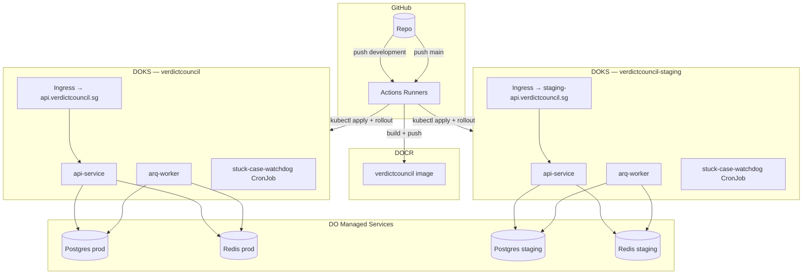

# Part 6: CI/CD Pipeline

> **Reality vs. Target State — read this first**
>
> This document mirrors the live CI/CD, flags gaps, and points at the manifests you can actually `kubectl apply`. The target columns are aspirations tracked for follow-up — the YAML and behaviour described below are what runs today unless explicitly marked *(target)*.
>
> | Area | Live | Target |
> |---|---|---|
> | Staging trigger | Push to `development` | Push to `release/**` |
> | Production trigger | Push to `main` | Push to `main` (unchanged) + `v*` tag |
> | Image strategy | Single polyvalent image; role selected by `command`/`args` per Deployment | Same image; optional per-component slim layers later |
> | Cluster topology | `api-service` Deployment + `arq-worker` Deployment + `stuck-case-watchdog` CronJob | unchanged; HPA on `api-service` is a follow-up |
> | Agent topology | All agents in-process inside the LangGraph `StateGraph` (no per-agent Deployment) | Unchanged. Earlier drafts proposed 9 agent microservices; that design was decommissioned with the SAM/Solace removal |
> | Smoke / canary tests | Not implemented | Post-deploy smoke (staging) + canary (prod) |
> | Coverage gate | `--cov-fail-under=65` enforced | 80 |
> | SAST / SCA / DAST | Advisory (`continue-on-error: true`) | SAST hard fail; DAST gated on a live FastAPI + Postgres |
> | Release tagging / GitHub Release | Not automated | `gh release create` on successful prod deploy |

---

## 6.1 Platform Overview

VerdictCouncil deploys to **DigitalOcean**:

| Service | Purpose | Why |
|---|---|---|
| **DOKS** (DigitalOcean Kubernetes Service) | Container orchestration | Managed control plane, automatic upgrades, integrated load balancer |
| **DOCR** (DigitalOcean Container Registry) | Docker image storage | Native DOKS integration, no image pull secrets needed |
| **DO Managed PostgreSQL 16** | Case records, graph checkpoints, audit logs | Automated backups, failover, connection pooling |
| **DO Managed Redis 7** | arq queue, precedent cache, PAIR rate-limit tokens | Managed HA, TLS, eviction policies |
| **DO Load Balancer** | HTTPS ingress | Auto-provisioned by NGINX ingress controller; Let's Encrypt via cert-manager |
| **DO Spaces** | Backup storage, CI artifacts | S3-compatible object storage |

### CI/CD Platform

**GitHub Actions** drives all automation, using `doctl` for deployment.

| Workflow | Trigger | Purpose | Target |
|---|---|---|---|
| `ci.yml` | Push to any branch; PR into `development` or `main` | lint → unit tests (65% cov) → SAST (bandit + semgrep) → SCA (pip-audit + safety + cyclonedx-bom SBOM) → DAST (smoke FastAPI behind a Postgres service, header + contract checks) → docker build verification → security summary → LangSmith eval gate (PR-only, path-filtered) | — |
| `deploy.yml` | Push to `development` → staging; push to `main` → production; `workflow_dispatch` for either | Build single image, push to DOCR (`rc-{sha}`/`staging-latest` for staging; `v{semver}`/`latest` for production), Trivy-scan, render secrets, `kubectl apply` the overlay with the pinned image tag, run Alembic, roll `api-service` + `arq-worker` | DOKS `verdictcouncil-staging` (development branch) / DOKS `verdictcouncil` (main branch) |
| `promptfoo-tests-ci.yml` | Push / PR (path-filtered) + dispatch | Per-phase prompt regression suite — deterministic JS asserts, llm-rubric groundedness, cost/latency budgets, baseline.json threshold gate | — |
| `promptfoo-redteam-ci.yml` | Weekly cron + dispatch + on redteam-config changes | Auto-generative red-team safety probes against the intake prompt (prompt injection, jailbreak, PII, hallucination, hijacking, harmful) | — |
| `infra-bootstrap.yml` | `workflow_dispatch` only | One-off cluster provisioning | DOKS bootstrap |

### GitHub Secrets Required

| Secret | Purpose |
|---|---|
| `DIGITALOCEAN_ACCESS_TOKEN` | All deploy workflows |
| `DOCR_REGISTRY` | Fully qualified registry prefix (e.g. `registry.digitalocean.com/verdictcouncil`) |
| `DOKS_STAGING_CLUSTER_ID` | Staging DOKS cluster ID |
| `DOKS_PRODUCTION_CLUSTER_ID` | Production DOKS cluster ID |
| `OPENAI_API_KEY` | Application secret — rendered into the K8s secret at deploy time |
| `OPENAI_VECTOR_STORE_ID` | Application secret — rendered at deploy time |
| `STAGING_DATABASE_URL`, `STAGING_REDIS_URL`, `STAGING_JWT_SECRET`, `STAGING_FRONTEND_ORIGINS` | Staging env wiring |
| `DATABASE_URL`, `REDIS_URL`, `JWT_SECRET`, `FRONTEND_ORIGINS` | Production env wiring |

Application secrets are **not** stored as plain K8s secrets in git; the deploy job renders them from GitHub Secrets into `verdictcouncil-secrets` via `kubectl create secret --dry-run=client | kubectl apply -f -`. The pod reads them via `envFrom: secretRef`.

---

## 6.2 CI Workflow (live)

Eleven jobs run on every push and on PRs into `development` or `main`. The DAST job spins up a Postgres service and a bare FastAPI instance; it runs basic header checks and the API contract tests. Security scans currently run in advisory mode — fix the findings on follow-up rather than trust the green tick.

```yaml
# .github/workflows/ci.yml — live (summary)
name: CI
on:
  push:
    branches: ["**"]
  pull_request:
    branches: [development, main]

permissions:
  contents: read           # default least-privilege; eval job widens to pull-requests:write

jobs:
  changes:              # dorny/paths-filter — gates the eval job on prompt/pipeline changes only
  lint:                 # ruff check + ruff format --check on src/ and tests/
  unit-tests:           # pytest --cov=src --cov-fail-under=65 (OPENAI_API_KEY blanked)
  property-tests:       # Hypothesis property-based tests (HYPOTHESIS_PROFILE=ci)
  sast:                 # bandit -r src/ + semgrep (p/security-audit, p/owasp-top-ten) → SARIF upload
  sca:                  # pip-audit --desc + cyclonedx-bom SBOM
  dast:                 # Postgres service; start uvicorn on :8000; header check; tests/integration/test_api_contract.py
  load-tests:           # Locust 30s smoke (5 users, advisory)
  build:                # docker buildx with GHA cache (no push) + Trivy SARIF upload
  security-summary:     # aggregates pip-audit + bandit output (advisory)
  eval:                 # PR-only, path-filtered: LangSmith golden-set regression gate (>5% scorer drop fails)
```

The `eval` job (folded in from a former separate `eval.yml`) is gated on
`github.event_name == 'pull_request' && needs.changes.outputs.eval == 'true'`,
so it only runs on PRs that touch `src/pipeline/**`, `src/agents/**`,
`tests/eval/**`, `**/prompts.py`, or `src/tools/**`. The wider
`pull-requests: write` permission is scoped to that single job via per-job
`permissions:` so the cheap jobs (lint, unit, etc.) keep `contents: read`
least-privilege.

### Gaps vs. target

| Area | Today | Target |
|---|---|---|
| Type checking | Not run | `mypy src/` in `lint` job |
| Coverage gate | 65 | 80 |
| SAST enforcement | `continue-on-error: true` on bandit + semgrep | Hard failure on medium+ findings |
| Integration tests | Not run in CI (run locally via `INTEGRATION_TESTS=1`) | Dedicated `integration-tests` job with Postgres + Redis services |
| Frontend snapshot diffing | N/A here | See frontend repo |

---

## 6.3 Docker Strategy

### Single image, two runtimes

The API (uvicorn) and the arq worker ship from the same image. The K8s manifests override `command`/`args` to select the entrypoint.

```dockerfile
# Dockerfile — single source of truth for both api and worker
FROM python:3.12-slim AS builder
WORKDIR /build
RUN apt-get update && apt-get install -y --no-install-recommends build-essential \
    && rm -rf /var/lib/apt/lists/*
COPY pyproject.toml .
COPY src/ src/
RUN pip install --no-cache-dir --prefix=/install .

FROM python:3.12-slim AS runtime
WORKDIR /app
# WeasyPrint deps for PDF export (hearing-pack endpoint)
RUN apt-get update && apt-get install -y --no-install-recommends \
    libpango-1.0-0 libpangoft2-1.0-0 libharfbuzz0b libcairo2 \
    libgdk-pixbuf-2.0-0 fonts-dejavu-core \
    && rm -rf /var/lib/apt/lists/*
COPY --from=builder /install /usr/local
COPY src/ /app/src/
COPY configs/ /app/configs/
RUN groupadd -r vcagent && useradd -r -g vcagent vcagent
USER vcagent
ENV PYTHONUNBUFFERED=1 PYTHONDONTWRITEBYTECODE=1 PYTHONPATH=/app
HEALTHCHECK --interval=30s --timeout=10s --retries=3 \
    CMD python -c "import httpx; httpx.get('http://localhost:8001/api/v1/health')" || exit 1
ENTRYPOINT ["uvicorn"]
CMD ["src.api.app:app", "--host", "0.0.0.0", "--port", "8001"]
```

K8s overrides per Deployment (one Deployment per role; both run from the same image):

```yaml
# api-service Deployment (k8s/base/deployment-api-service.yaml)
command: ["uvicorn"]
args: ["src.api.app:app", "--host", "0.0.0.0", "--port", "8001"]

# arq-worker Deployment (k8s/base/deployment-arq-worker.yaml)
command: ["arq"]
args: ["src.workers.worker_settings.WorkerSettings"]
```

The arq worker hosts the LangGraph `StateGraph` in-process and drains the `pipeline_jobs` Postgres outbox; the agents are nodes in that graph, not separate Deployments. Earlier drafts of this section described a nine-Deployment per-agent split (one container per agent, fronted by its own ClusterIP Service, called over HTTP from a separate Orchestrator). That design was decommissioned with the SAM/Solace removal — there is no `src.agents.main` module, no `/invoke` HTTP contract, no `AGENT_HMAC_SECRET`, no `DISPATCH_MODE`. If we ever need per-agent containers again, this is the natural extension point, but it is not on the roadmap.

### Image naming

```
{DOCR_REGISTRY}/verdictcouncil:{tag}
```

| Stage | Tag | Source |
|---|---|---|
| Feature CI | (no push) | GHA cache only |
| Staging | `rc-{sha}` | `deploy.yml` (push to `development`) |
| Production | `v{semver}` + `latest` | `deploy.yml` (push to `main`; reads `git describe --tags --abbrev=0`) |

### DOCR Integration with DOKS

```bash
doctl kubernetes cluster registry add <cluster-id>
```

Once bound, DOKS nodes pull from DOCR without image pull secrets.

---

## 6.4 Deploy Workflow (live)

A single `deploy.yml` covers both environments. The branch determines the
target — `development` → staging, `main` → production — and every
env-specific value (namespace, kustomize overlay, image tag scheme,
cluster ID, DB/Redis/JWT secrets, Trivy SARIF category) is derived from
`github.ref_name` via ternary expressions in the job-level `env:` block.
GitHub's `environment:` is set conditionally on the same expression so
env-scoped protection rules (e.g. required reviewers on production)
still apply.

```yaml
# .github/workflows/deploy.yml — live (summary)
name: Deploy
on:
  push:
    branches: [development, main]
  workflow_dispatch:

permissions:
  contents: read

jobs:
  deploy:
    runs-on: ubuntu-latest
    environment: ${{ github.ref_name == 'main' && 'production' || 'staging' }}
    env:
      IS_PROD:          ${{ github.ref_name == 'main' }}
      ENV_NAME:         ${{ github.ref_name == 'main' && 'production' || 'staging' }}
      NAMESPACE:        ${{ github.ref_name == 'main' && 'verdictcouncil' || 'verdictcouncil-staging' }}
      OVERLAY:          ${{ github.ref_name == 'main' && 'production' || 'staging' }}
      ROLLING_TAG:      ${{ github.ref_name == 'main' && 'latest' || 'staging-latest' }}
      DOKS_CLUSTER_ID:  ${{ github.ref_name == 'main' && secrets.DOKS_PRODUCTION_CLUSTER_ID || secrets.DOKS_STAGING_CLUSTER_ID }}
      DATABASE_URL:     ${{ github.ref_name == 'main' && secrets.DATABASE_URL || secrets.STAGING_DATABASE_URL }}
      REDIS_URL:        ${{ github.ref_name == 'main' && secrets.REDIS_URL || secrets.STAGING_REDIS_URL }}
      JWT_SECRET:       ${{ github.ref_name == 'main' && secrets.JWT_SECRET || secrets.STAGING_JWT_SECRET }}
      FRONTEND_ORIGINS: ${{ github.ref_name == 'main' && secrets.FRONTEND_ORIGINS || secrets.STAGING_FRONTEND_ORIGINS }}
    steps:
      - uses: actions/checkout@v4
        with: { fetch-depth: 0 }   # required for `git describe` on the production path
      - uses: digitalocean/action-doctl@v2
        with: { token: ${{ secrets.DIGITALOCEAN_ACCESS_TOKEN }} }
      - run: doctl registry login

      - name: Build and push image
        run: |
          if [ "$IS_PROD" = "true" ]; then
            TAG=$(git describe --tags --abbrev=0 2>/dev/null || echo "latest")
          else
            TAG="rc-${{ github.sha }}"
          fi
          IMAGE="${{ secrets.DOCR_REGISTRY }}/verdictcouncil:${TAG}"
          ROLLING="${{ secrets.DOCR_REGISTRY }}/verdictcouncil:${ROLLING_TAG}"
          docker build -t "${IMAGE}" -t "${ROLLING}" .
          docker push "${IMAGE}"
          docker push "${ROLLING}"
          echo "IMAGE=${IMAGE}" >> "$GITHUB_ENV"

      - name: Trivy image scan          # advisory; uploads SARIF to the Security tab
      - name: Configure kubectl         # doctl kubernetes cluster kubeconfig save "${DOKS_CLUSTER_ID}"
      - name: Render secrets            # kubectl create secret generic verdictcouncil-secrets --dry-run | apply
      - name: Apply manifests with pinned image
        run: |
          kubectl kustomize "k8s/overlays/${OVERLAY}/" \
            | sed "s|image: verdictcouncil:latest|image: ${IMAGE}|g" \
            | kubectl apply -f -
      - name: Run database migrations   # alembic Job, sed'd to the new image
      - name: Wait for rollouts         # api-service + arq-worker
```

**Tag scheme by branch:**

| Branch | Tag | Rolling tag |
|---|---|---|
| `development` → staging | `rc-{sha}` | `staging-latest` |
| `main` → production | `git describe --tags --abbrev=0` (e.g. `v1.2.0`) | `latest` |

**Known follow-ups:**

- Add a **smoke job** post-deploy that hits `/api/v1/health`, logs in as the env's test user, submits a fixture case, and polls `/api/v1/cases/{id}` until `ready_for_review` or `escalated` (or fails after 300s). Promote to a **canary job** for production with a dedicated test account that cannot touch real case data.
- Automate GitHub Release creation on production deploys: `gh release create "$TAG" --generate-notes --target main`.
- Gate the production path on the presence of a `v*` tag on `HEAD`; fail if missing rather than silently pushing `latest`.

---

## 6.5 Kubernetes Manifests

Layout:

```
k8s/
├── base/
│   ├── namespace.yaml
│   ├── deployment-api-service.yaml
│   ├── service-api-service.yaml
│   ├── ingress.yaml
│   ├── cronjob-stuck-case-watchdog.yaml
│   ├── job-alembic-migrate.yaml            # applied separately by deploy workflow, not via kustomize
│   ├── secrets.yaml                        # template only; populated at deploy time
│   └── kustomization.yaml
└── overlays/
    ├── staging/
    │   └── kustomization.yaml              # namespace: verdictcouncil-staging
    └── production/
        └── kustomization.yaml              # namespace: verdictcouncil
```

Registered in the base kustomization: `namespace`, `deployment-api-service`, `service-api-service`, `ingress`, `cronjob-stuck-case-watchdog`. The Alembic job is applied separately by the deploy workflows so it can be sed'd to the current image tag.

### API Service Deployment (live)

```yaml
apiVersion: apps/v1
kind: Deployment
metadata:
  name: api-service
  namespace: verdictcouncil
  labels: {app: verdictcouncil, component: api-service}
spec:
  replicas: 1
  selector:
    matchLabels: {app: verdictcouncil, component: api-service}
  template:
    metadata:
      labels: {app: verdictcouncil, component: api-service}
    spec:
      containers:
        - name: api-service
          image: verdictcouncil:latest
          command: ["uvicorn"]
          args: ["src.api.app:app", "--host", "0.0.0.0", "--port", "8001"]
          ports:
            - containerPort: 8001
          envFrom:
            - secretRef: {name: verdictcouncil-secrets}
          resources:
            requests: {cpu: 250m, memory: 256Mi}
            limits:   {cpu: 500m, memory: 512Mi}
          livenessProbe:
            httpGet: {path: /metrics, port: 8001}
            initialDelaySeconds: 15
            periodSeconds: 30
            failureThreshold: 3
          readinessProbe:
            httpGet: {path: /metrics, port: 8001}
            initialDelaySeconds: 10
            periodSeconds: 10
            failureThreshold: 3
```

### `arq-worker` Deployment (live — `k8s/base/deployment-arq-worker.yaml`)

```yaml
apiVersion: apps/v1
kind: Deployment
metadata:
  name: arq-worker
  namespace: verdictcouncil
  labels: {app: verdictcouncil, component: arq-worker}
spec:
  replicas: 1
  selector:
    matchLabels: {app: verdictcouncil, component: arq-worker}
  template:
    metadata:
      labels: {app: verdictcouncil, component: arq-worker}
    spec:
      terminationGracePeriodSeconds: 900   # WorkerSettings.job_timeout
      containers:
        - name: arq-worker
          image: verdictcouncil:latest
          command: ["arq"]
          args: ["src.workers.worker_settings.WorkerSettings"]
          envFrom:
            - secretRef: {name: verdictcouncil-secrets}
          resources:
            requests: {cpu: 250m, memory: 256Mi}
            limits:   {cpu: 500m, memory: 512Mi}
          livenessProbe:
            exec:
              command: ["arq", "--check", "src.workers.worker_settings.WorkerSettings"]
            initialDelaySeconds: 30
            periodSeconds: 60
            failureThreshold: 3
```

Rationale for keeping the worker separate from the API:

- Pipeline runs spike CPU/memory while the API stays steady; scaling independently is cheaper.
- A stuck pipeline run must not take the API (and therefore the frontend) down.
- Logs are easier to reason about when job spans stay inside one container.

The compiled LangGraph `StateGraph` is held in process memory inside the worker; agent nodes execute as Python function calls, not over HTTP. There is no separate "Orchestrator" Deployment and no per-agent Deployment — earlier drafts of this document described both, but that nine-agent microservices split was decommissioned with the SAM/Solace removal. The graph topology is documented in `docs/architecture/02-system-architecture.md`.

### Build strategy

Both Deployments run the same `verdictcouncil:<tag>` image; the role is selected by `command`/`args`. This keeps the build matrix to one image and keeps image-layer cache hits high across roles. If we ever need per-agent slim images (e.g. only the `legal-knowledge` agent's deps in its container), the natural extension is a Docker matrix build — but that's not on the roadmap.

### Ingress (live)

```yaml
apiVersion: networking.k8s.io/v1
kind: Ingress
metadata:
  name: verdictcouncil-ingress
  namespace: verdictcouncil
  annotations:
    cert-manager.io/cluster-issuer: letsencrypt-prod
    nginx.ingress.kubernetes.io/proxy-body-size: "50m"      # matches case_doc_max_upload_bytes
    nginx.ingress.kubernetes.io/proxy-buffering: "off"
    nginx.ingress.kubernetes.io/proxy-read-timeout: "3600"  # allows long SSE streams for in-flight pipelines
spec:
  ingressClassName: nginx
  tls:
    - hosts: [api.verdictcouncil.sg]
      secretName: verdictcouncil-tls
  rules:
    - host: api.verdictcouncil.sg
      http:
        paths:
          - path: /api/v1
            pathType: Prefix
            backend:
              service: {name: api-service, port: {number: 8001}}
```

### Stuck-Case Watchdog CronJob (live)

Runs every 5 minutes; moves cases stuck > 30 min into `failed_retryable`. Shares the same image + secret.

```yaml
apiVersion: batch/v1
kind: CronJob
metadata:
  name: stuck-case-watchdog
  namespace: verdictcouncil
spec:
  schedule: "*/5 * * * *"
  concurrencyPolicy: Forbid
  successfulJobsHistoryLimit: 3
  failedJobsHistoryLimit: 5
  jobTemplate:
    spec:
      backoffLimit: 0
      template:
        spec:
          restartPolicy: Never
          containers:
            - name: watchdog
              image: verdictcouncil:latest
              command: ["python", "-m", "src.services.stuck_case_watchdog"]
              envFrom:
                - secretRef: {name: verdictcouncil-secrets}
              resources:
                requests: {cpu: 50m, memory: 128Mi}
                limits:   {cpu: 100m, memory: 256Mi}
```

### Alembic Migrate Job (live)

```yaml
apiVersion: batch/v1
kind: Job
metadata:
  name: alembic-migrate
  namespace: verdictcouncil
spec:
  ttlSecondsAfterFinished: 3600
  backoffLimit: 2
  template:
    spec:
      restartPolicy: OnFailure
      containers:
        - name: migrate
          image: verdictcouncil:latest
          command: ["alembic", "upgrade", "head"]
          envFrom:
            - secretRef: {name: verdictcouncil-secrets}
```

### Secret template (not committed with real values)

Production and staging both use `verdictcouncil-secrets` (populated by the deploy workflow). The template exists at `k8s/base/secrets.yaml` as a placeholder; values come from GitHub Secrets via `kubectl create secret --dry-run=client | kubectl apply -f -`.

### HorizontalPodAutoscaler (target)

Not in base yet. Target:

- **vc-api** scales on CPU + RPS (NGINX metrics via Prometheus adapter).
- **vc-orchestrator** scales on arq queue depth.
- **Per-agent HPAs** scale each agent on a queue-free signal — request concurrency at the Service + p95 latency. Frontier-tier agents scale more aggressively because they sit on the critical path.

---

## 6.6 Environment Promotion

```
  ┌─────────────────┐     ┌─────────────────┐     ┌──────────────────┐
  │   feat/<name>   │ ──▶│   development   │ ──▶│    release/...    │
  └─────────────────┘     └─────────────────┘     └──────────────────┘
                               │                          │
                       deploy.yml (staging path)   deploy.yml (production path)
                               ▼                          ▼
                      DOKS verdictcouncil-staging   DOKS verdictcouncil
```

- Feature branches merge into `development` via PR; CI must pass.
- `development` → staging: push triggers `deploy.yml`'s staging path (today). Target is to move staging onto `release/**` so that `development` can absorb integration work without auto-deploying.
- `release/<context>/<tag>` → `main`: merge after staging QA passes. Push to `main` triggers `deploy.yml`'s production path.
- Hotfix branches: branch from `main`, PR into `main`, then back-port into `development`.

---

## 6.7 DigitalOcean Architecture



---
