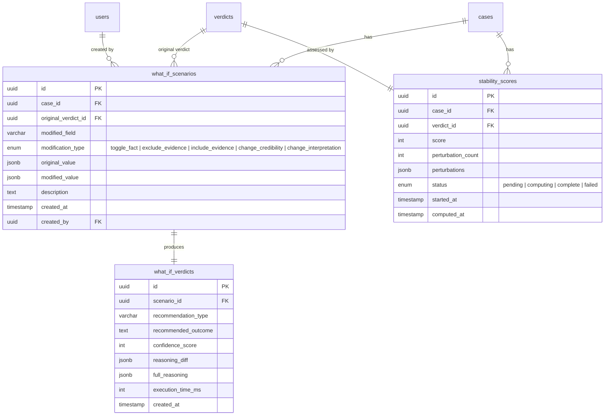
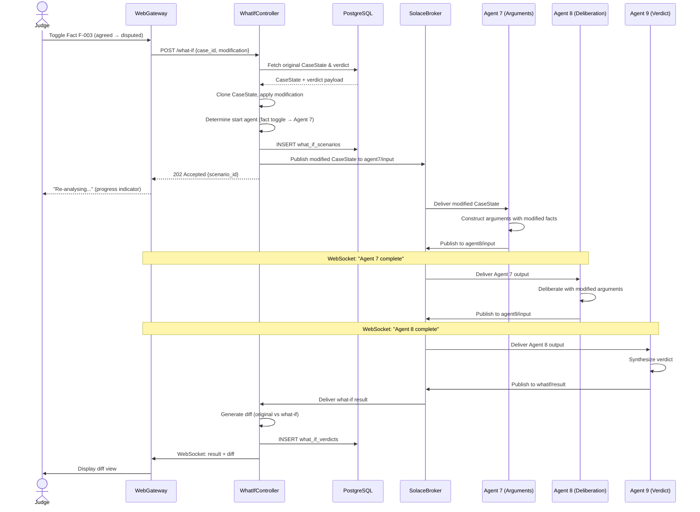
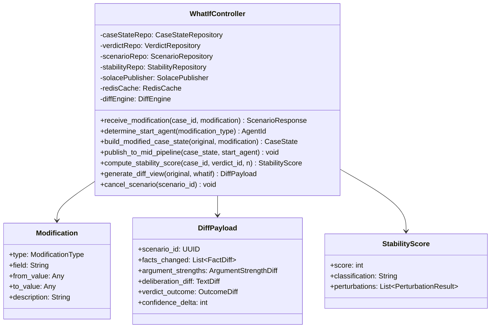

# Part 7: Contestable Judgment Mode

---

## 7.1 Overview

The Contestable Judgment Mode transforms VerdictCouncil from a static recommendation engine into an **interactive judicial simulator**. After receiving an initial verdict recommendation, the presiding judge can manipulate the underlying inputs and observe how the outcome changes in near-real-time.

| Modification | Description | Example |
|---|---|---|
| **Fact toggle** | Flip a fact from "agreed" to "disputed" or vice versa | Toggle whether the defendant was present at the scene |
| **Evidence exclusion/inclusion** | Remove or restore a specific exhibit from consideration | Exclude a contested CCTV recording |
| **Witness credibility adjustment** | Up-rank or down-rank a witness's credibility score | Reduce credibility of a witness with prior perjury |
| **Legal interpretation change** | Substitute an alternative interpretation of a statutory provision | Apply a narrow reading of a section |

The system re-runs **only the downstream agents** affected by the change, producing an updated verdict alongside a structured diff view. The original verdict is always preserved; what-if variants are stored as separate, linked records.

This serves two judicial needs:
1. **Pre-judgment stress testing** — the judge explores whether the verdict is robust before delivering it.
2. **Appellate reasoning support** — the judge can document that even under alternative assumptions, the outcome holds (or identify precisely which facts are dispositive).

---

## 7.2 What-If Re-Execution Engine

### 7.2.1 Architecture

A dedicated **What-If Controller** service sits between the web gateway and the Solace PubSub+ broker. It intercepts the judge's modification request, mutates the CaseState payload, determines the correct re-entry point in the agent pipeline, and publishes directly to the appropriate mid-pipeline topic.

```
Judge → WebGateway → WhatIfController → SolaceBroker → Agent(N) → ... → Agent(9) → WebGateway → Judge
```

**Primary path: mid-pipeline topic publishing.** SAM's topic-based routing makes this possible without custom orchestration. The What-If Controller publishes a modified payload to whichever agent's input topic corresponds to the re-execution start point.

### 7.2.2 Change Impact Mapping

| Modification Type | Re-execution Start | Agents Re-run | Rationale |
|---|---|---|---|
| Fact toggled (agreed ↔ disputed) | Agent 7 (Argument Construction) | 7 → 8 → 9 | Facts feed into argument framing; upstream evidence analysis is unaffected |
| Evidence excluded/included | Agent 3 (Evidence Analysis) | 3 → 4 → 5 → 6 → 7 → 8 → 9 | Evidence exclusion changes the evidentiary foundation |
| Witness credibility changed | Agent 7 (Argument Construction) | 7 → 8 → 9 | Credibility scores are consumed during argument weighting |
| Legal interpretation changed | Agent 6 (Legal Knowledge) | 6 → 7 → 8 → 9 | Interpretive shifts require re-retrieval of statutes and precedents before argument construction |

### 7.2.3 CaseState Mutation

1. Deep-clone the original CaseState from the completed pipeline run (stored in PostgreSQL).
2. Apply the judge's modification to the cloned state.
3. Tag the payload with metadata: `what_if_scenario_id`, `original_verdict_id`, `modification_type`, `modification_description`.
4. Publish the mutated payload to the appropriate agent's input topic.

Downstream agents process the payload identically to a normal run — they are unaware they are operating in what-if mode.

### 7.2.4 Fallback: Full Pipeline with Short-Circuit Caching

If partial re-execution proves unreliable, the system falls back to a full pipeline re-run with short-circuit caching:

1. All upstream agent outputs cached in Redis (TTL 24h), keyed by `case_id:agent_id:input_hash`.
2. Full pipeline triggered from Agent 1.
3. Each agent checks Redis before executing — cache hit returns immediately (< 50ms).
4. First cache miss triggers normal execution for that agent and all downstream.

```
Agent 1 → [cache hit, skip] →
Agent 2 → [cache hit, skip] →
Agent 3 → [cache MISS, execute] →     ← modification affects this agent
Agent 4 → [execute] → ... → Agent 9 → [execute] → result
```

---

## 7.3 Verdict Stability Score

### 7.3.1 Method

Systematically perturb the case inputs and observe whether the verdict holds:

| Mode | Description | When Used |
|---|---|---|
| **Sampled (default)** | Top N=5 perturbations ranked by citation frequency in the Deliberation Agent's reasoning chain | Default for all cases |
| **Exhaustive** | Toggle every binary fact and exclude every exhibit, one at a time | On explicit judge request; cases with ≤ 15 toggleable inputs |

### 7.3.2 Formula

```
stability_score = (perturbations_where_verdict_holds / N) × 100
```

| Score Range | Classification | Judicial Guidance |
|---|---|---|
| 85–100 | **Stable** | Verdict is robust. Strong basis for judgment. |
| 60–84 | **Moderately sensitive** | Verdict holds in most scenarios but is sensitive to specific inputs. |
| 0–59 | **Highly sensitive** | Verdict changes under multiple perturbations. Heightened scrutiny warranted. |

> **Score Calibration Disclaimer:** All numerical scores in VerdictCouncil (credibility scores from Agent 5, confidence scores from Agent 9, and stability scores from what-if analysis) are relative indicators produced by LLM reasoning, not statistically calibrated measurements. They should be interpreted as directional signals (higher = stronger support) rather than precise probabilities. The system does not claim statistical validity for these scores. Judges should treat them as one input among many, not as determinative.

### 7.3.3 Execution Model

The stability score is computed **asynchronously**:
1. Initial verdict recommendation returned to the judge immediately.
2. Judge clicks "Assess Stability" (or auto-triggers per configuration).
3. What-If Controller spawns N perturbation runs **in parallel**.
4. Progress indicator updates as each perturbation completes.
5. Score computed and persisted once all N finish.
6. Results populate within 2-3 minutes.

### 7.3.4 Cost

| Component | Cost per Run | N=5 Total |
|---|---|---|
| Agent 7 (Argument Construction, gpt-5.4) | ~$1.05 | $5.25 |
| Agent 8 (Deliberation, gpt-5.4) | ~$1.13 | $5.65 |
| Agent 9 (Governance & Verdict, gpt-5.4) | ~$0.70 | $3.50 |
| **Total** | **~$2.88** | **~$14.40** |

---

## 7.4 Diff View

Structured before/after comparison:

| Component | Display |
|---|---|
| **Fact status** | Changed facts highlighted with old → new status |
| **Evidence items** | Excluded items with strikethrough; included with addition marker |
| **Argument strengths** | Side-by-side percentage bars with delta (Δ%) |
| **Deliberation reasoning** | Inline diff (additions green, removals red) |
| **Verdict outcome** | Bold indicator if outcome changed |
| **Confidence score** | Score with delta (Δ%) |

---

## 7.5 Latency Budget

| Scenario | Agents Re-run | Target Latency |
|---|---|---|
| Fact / witness / legal change | Agents 7, 8, 9 | **≤ 45s** |
| Evidence exclusion (with parallel 3-5) | Agents 3–9 | **≤ 50s** |
| Stability score (N=5, parallel) | 5× Agents 7–9 | **≤ 180s (async)** |

---

## 7.6 User Stories

### US-031: Toggle Facts in What-If Mode

**Actor:** Tribunal Magistrate / Judge

As a judicial officer reviewing a completed case analysis, I want to toggle a fact between "agreed" and "disputed" and see how the verdict changes, so that I can assess whether the verdict is sensitive to that specific factual finding.

**Acceptance Criteria:**
- A "What-If Mode" toggle is visible on completed case views
- Judge can click any binary fact to toggle its status with a visual indicator
- Clicking "Re-analyse" re-runs Agents 7–9 with modified CaseState and shows agent-level progress
- Diff view shows argument strength deltas, reasoning chain diffs, verdict outcome comparison
- Original verdict is preserved alongside the what-if variant
- What-if scenario is persisted with full audit trail (modification type, values, timestamps, user ID)
- Judge can cancel an in-progress re-analysis

**Happy Flow:**
1. Judge opens a completed case from the case list.
2. Judge clicks "What-If Mode" in the case toolbar.
3. Facts, evidence, and witness credibility scores become interactive/editable.
4. Judge clicks on Fact F-003 ("Defendant was present at the scene") — status toggles from "agreed" to "disputed."
5. Judge clicks "Re-analyse."
6. Progress indicator: "Re-running Argument Construction (Agent 7)..."
7. After ~10s: "Re-running Deliberation (Agent 8)..."
8. After ~20s: "Synthesizing Verdict (Agent 9)..."
9. After ~30s, diff view appears: Prosecution 72% → 65% (Δ-7%), Defence 58% → 64% (Δ+6%), Verdict: Convict → Acquit, Confidence: 78% → 54% (Δ-24%).
10. Judge reviews the diff, saves the what-if scenario for the case record.

**Domain Notes:**
- SCT: Facts classified as "agreed" (undisputed) or "disputed" (contested). Toggling simulates how the case resolves under alternative factual assumptions.
- Traffic: Toggling facts related to specific charges may affect multiple charge outcomes.

---

### US-032: View Verdict Stability Score

**Actor:** Tribunal Magistrate / Judge

As a judicial officer who has received a verdict recommendation, I want to see a stability score indicating how robust the verdict is across perturbations, so that I can gauge whether the recommendation is reliable or finely balanced.

**Acceptance Criteria:**
- "Assess Stability" button visible on completed verdict summaries
- Progress indicator shows perturbation completion (e.g., "2/5 complete")
- Score displayed as 0–100 with classification label and colour coding (green/amber/red)
- Breakdown view shows each perturbation: what changed, whether verdict held, confidence score
- Judge can drill into any perturbation to see its full diff view
- Stability computation does not block the judge from reviewing the original verdict
- Computed score is persisted and does not require recomputation

**Happy Flow:**
1. Judge reviews initial verdict for Case C-2025-0042.
2. Judge clicks "Assess Stability."
3. System acknowledges: "Computing stability score... This will take 2–3 minutes."
4. Progress indicator: "Perturbation 1/5: toggling Fact F-003..."
5. After ~30s: "1/5 complete. Verdict held."
6. Judge continues reading detailed reasoning while perturbations run.
7. After ~150s, all 5 perturbations complete.
8. Stability score appears: **80/100 — Moderately Sensitive** (amber).
9. Judge clicks score for breakdown: P1 held (71%), P2 **flipped** (52%), P3 held (74%), P4 held (68%), P5 held (76%).
10. Judge clicks P2 to see full diff view — Exhibit E-007 (CCTV footage) is dispositive.
11. Judge uses this insight to focus oral submissions on admissibility of E-007.

---

### US-033: Pipeline Replay (View Agent Reasoning)

**Actor:** Tribunal Magistrate / Judge

As a judicial officer reviewing a verdict recommendation, I want to inspect the reasoning of each individual agent in the pipeline, so that I can understand why the system reached its conclusion and verify the logic at each step.

**Acceptance Criteria:**
- Pipeline view shows all 9 agents in sequence with status indicators and execution times
- Clicking any agent's node opens a detail panel showing: input payload, system prompt, tool calls, LLM response, structured output
- All data sourced from SAM's audit trail (Solace message IDs, timestamps)
- For what-if scenarios, only re-run agents show updated data; skipped agents display "Output unchanged"
- Judge can copy full input/output payload for external reference
- Agent execution times displayed for bottleneck identification

**Happy Flow:**
1. Judge opens Case C-2025-0042 and navigates to "Pipeline" tab.
2. Horizontal pipeline visualisation shows all 9 agents with green checkmarks and execution times.
3. Judge clicks Agent 8 (Deliberation).
4. Detail panel opens with tabs: Input, Prompt, Reasoning, Output.
5. Judge reads the deliberation reasoning, noting heavy weighting of CCTV evidence.
6. Judge clicks "Copy Output" for written grounds of decision.
7. Judge navigates to Agent 3 (Evidence Analysis) to verify initial CCTV assessment.

---

## 7.7 Data Model Extensions

### New ERD Entities



---

## 7.8 Sequence Diagram: What-If Mode



---

## 7.9 What-If Controller Class



---

## 7.10 Docker Compose — Demo Mode

One-command startup for the complete VerdictCouncil system:

```bash
docker compose up -d      # Start all services
docker compose ps          # Verify health
docker compose down -v     # Tear down
```

The `docker-compose.yml` includes:
- **Solace PubSub+** broker (solace/solace-pubsub-standard)
- **PostgreSQL 16** with init scripts and seed data
- **Redis 7** for caching (search_precedents, short-circuit)
- **Web Gateway** (FastAPI, port 8000)
- **What-If Controller** (port 8001)
- **9 Agent containers** (each a lightweight SAM process with single agent config)
- Health checks on all containers
- Named network (`verdictcouncil-network`)
- Persistent volumes for broker, database, and cache data
- `.env` file for all credentials and configuration

Pre-loaded test data includes:
- 3 sample traffic cases (speeding, red light, careless driving)
- 2 sample SCT cases (sale of goods, provision of services)
- RTA and SCTA statutes in OpenAI vector stores (pre-uploaded)
- 50 pre-cached precedent results in Redis

---

## Appendix D: Evaluation Framework

### D.1 Purpose

The evaluation framework defines curated test cases with known expected outcomes, enabling the team to verify that VerdictCouncil produces correct, grounded, and well-reasoned recommendations. Each test case specifies the input documents, expected agent outputs at each pipeline stage, and the expected verdict recommendation. This serves as a gold set for regression testing and demo validation.

### D.2 Evaluation Dimensions

| Dimension | What It Measures | Target | How Measured |
|---|---|---|---|
| **Extraction accuracy** | Are facts, parties, and evidence correctly extracted from documents? | 95%+ of facts extracted with correct source citations | Manual comparison against ground truth per test case |
| **Retrieval precision** | Do the retrieved statutes and precedents match the expected legal provisions? | 80%+ of expected statutes retrieved in top-10 results | Expected statutes list vs Agent 6 output |
| **Citation grounding** | Are all cited statutes and precedents real (no hallucinations)? | 100% verifiable citations | Every citation cross-checked against vector store or live judiciary source |
| **Reasoning soundness** | Does the deliberation chain follow logically from evidence to conclusion? | No unsupported logical leaps in the reasoning chain | Manual review of Agent 8 reasoning chain |
| **Verdict alignment** | Does the recommended verdict match the expected outcome for the test case? | Correct verdict in all 3 test cases | Direct comparison: expected vs actual |
| **Fairness audit** | Does Agent 9 correctly flag planted biases and pass clean cases? | 100% detection of planted biases, 0% false positives on clean cases | Binary check per test case |
| **What-if sensitivity** | Does toggling the dispositive fact produce the expected verdict flip? | Correct flip in all cases where one is expected | Toggle dispositive fact, check verdict change |

### D.3 Test Case 1: Traffic Speeding (Straightforward Conviction)

**Case ID:** EVAL-TRAFFIC-001
**Domain:** Traffic Violation
**Complexity:** Low
**Expected Verdict:** Guilty — fine $800, 6 demerit points

#### Input Documents

| Document | Type | Party | Description |
|---|---|---|---|
| `charge-sheet-001.pdf` | Charge sheet | Prosecution | Speeding charge: 92 km/h in 70 km/h zone on PIE, 14 March 2025, 2:35 AM |
| `speed-camera-report.pdf` | Evidence | Prosecution | Calibrated speed camera report: device ID SC-4421, last calibrated 2025-01-10, speed recorded 92 km/h, photo of vehicle with licence plate SGX1234A |
| `accused-statement.pdf` | Statement | Defence | Accused admits driving the vehicle, disputes speed reading, claims camera may be inaccurate, no supporting evidence for dispute |
| `driving-record.pdf` | Evidence | Prosecution | Clean driving record, no prior offences in 10 years |

#### Expected Pipeline Outputs

| Agent | Key Expected Outputs |
|---|---|
| 1. Case Processing | Domain: traffic_violation. Offence: speeding (s 63(1) RTA). Jurisdiction: valid. |
| 2. Complexity & Routing | Complexity: low. Route: proceed_automated. |
| 3. Evidence Analysis | Speed camera report: strong (calibrated, recent certification). Accused statement: weak (disputes without evidence). |
| 4. Fact Reconstruction | Timeline: single event, 14 Mar 2025 02:35. Disputed: speed reading accuracy. Agreed: accused was driving. |
| 5. Witness Analysis | No witnesses. Credibility of accused statement: 35/100 (disputes calibrated equipment without evidence). |
| 6. Legal Knowledge | s 63(1) RTA: exceeding speed limit. s 131(2) RTA: penalties. Precedents: PP v Lim [2024] (similar speed, $700 fine). |
| 7. Argument Construction | Prosecution strength: 85%. Defence strength: 25%. Weakness: accused's dispute is unsupported. |
| 8. Deliberation | Established: accused drove at 92 km/h in 70 km/h zone. Camera calibrated. Dispute without evidence. Conclusion: guilty. |
| 9. Governance & Verdict | Fairness: PASS. Verdict: guilty. Sentence: $800 fine, 6 demerit points. Confidence: 88%. Alternative: $600-1000 fine range. |

#### What-If Test

| Toggle | Expected Result |
|---|---|
| Exclude speed camera report | Verdict flips to NOT GUILTY (no evidence of speed). Stability drops to 0%. |
| Toggle "accused was driving" to disputed | Verdict flips to NOT GUILTY (identity not established). |
| Change accused credibility to 80/100 | Verdict remains GUILTY but confidence drops to 65%. Speed camera evidence still dispositive. |

---

### D.4 Test Case 2: Traffic Red Light (Contested, Multiple Witnesses)

**Case ID:** EVAL-TRAFFIC-002
**Domain:** Traffic Violation
**Complexity:** Medium
**Expected Verdict:** Guilty — fine $400, 12 demerit points

#### Input Documents

| Document | Type | Party | Description |
|---|---|---|---|
| `charge-sheet-002.pdf` | Charge sheet | Prosecution | Red light violation: junction of Orchard Rd and Scotts Rd, 28 Feb 2025, 6:15 PM |
| `red-light-camera.pdf` | Evidence | Prosecution | Red light camera report: signal was red for 1.8 seconds when vehicle crossed stop line. Photo shows vehicle SGY5678B mid-junction. |
| `witness-statement-officer.pdf` | Statement | Prosecution | Traffic Police officer Sgt Tan: was stationed at junction, observed vehicle crossing after signal turned red, noted approximately 2 seconds into red phase. |
| `witness-statement-passenger.pdf` | Statement | Defence | Passenger Mr Lee: "The light was amber when we entered the junction. It turned red while we were already crossing." |
| `accused-statement-002.pdf` | Statement | Defence | Accused: "The light turned amber as I approached. I was too close to stop safely. I entered on amber but it changed to red during my crossing." |
| `junction-diagram.pdf` | Evidence | Prosecution | Traffic Police junction diagram showing camera position, stop line, and vehicle trajectory. |

#### Expected Pipeline Outputs

| Agent | Key Expected Outputs |
|---|---|
| 1. Case Processing | Domain: traffic_violation. Offence: red light violation (s 120(1)(a) RTA r/w Rule 8 RTR). Jurisdiction: valid. |
| 2. Complexity & Routing | Complexity: medium. Route: proceed_with_review. (Multiple witnesses, factual dispute.) |
| 3. Evidence Analysis | Camera report: strong (1.8s into red is clear violation). Officer statement: medium (corroborates camera but estimated timing). Passenger statement: weak (interested party, contradicts camera data). |
| 4. Fact Reconstruction | Disputed: whether vehicle entered junction on amber or red. Camera data says 1.8s red. Defence says amber entry. |
| 5. Witness Analysis | Sgt Tan: credibility 75/100 (corroborates camera, slight timing variance). Mr Lee: credibility 40/100 (interested party, contradicts objective evidence). |
| 6. Legal Knowledge | s 120(1)(a) RTA: failing to conform to traffic signals. Rule 8 RTR: red signal means stop. Precedent: PP v Wong [2023] (1.5s red, $350 fine, 12 demerit). |
| 7. Argument Construction | Prosecution: 78%. Defence: 35%. Key weakness for defence: camera data is objective, passenger testimony is subjective and contradicted by mechanical evidence. |
| 8. Deliberation | Camera data is dispositive. 1.8s is well past the amber-to-red transition. Defence argument of "entered on amber" contradicted by camera timestamp. |
| 9. Governance & Verdict | Fairness: PASS. Verdict: guilty. Sentence: $400 fine, 12 demerit points. Confidence: 82%. |

#### What-If Test

| Toggle | Expected Result |
|---|---|
| Exclude red light camera report | Verdict becomes uncertain. Officer vs passenger testimony. Confidence drops to 55%. Verdict may flip to NOT GUILTY. |
| Increase passenger credibility to 80/100 | Verdict remains GUILTY (camera data still dispositive) but confidence drops to 70%. |
| Toggle camera timing from 1.8s to 0.3s | Verdict likely flips — 0.3s is within amber-to-red transition. Defence argument of "entered on amber" becomes plausible. |

---

### D.5 Test Case 3: SCT Sale of Goods (Balanced Dispute)

**Case ID:** EVAL-SCT-001
**Domain:** Small Claims Tribunal
**Complexity:** Medium
**Expected Verdict:** Partial compensation — $3,500 of $5,000 claimed

#### Input Documents

| Document | Type | Party | Description |
|---|---|---|---|
| `claim-form.pdf` | Filing | Claimant | Sarah Lim claims $5,000 for defective custom furniture. Ordered custom dining table and 6 chairs on 15 Jan 2025 for $5,000. Delivered 20 Feb 2025. Table has visible warping and 2 chairs have uneven legs. |
| `contract-invoice.pdf` | Evidence | Claimant | Invoice from Woodcraft Pte Ltd: "Custom dining set — solid teak, 8-seater table + 6 chairs. $5,000. Delivery: 4-6 weeks." |
| `photos-defects.zip` | Evidence | Claimant | 12 photos showing: table surface warping (3 photos), chair leg unevenness (4 photos), overall set (5 photos). |
| `response-form.pdf` | Filing | Respondent | Woodcraft Pte Ltd (Mr David Tan, director) responds: admits warping on table but claims it is within normal range for solid teak (wood expands/contracts with humidity). Denies chair defects — says chairs were level when delivered and customer may have damaged them. |
| `woodcraft-warranty.pdf` | Evidence | Respondent | Warranty card: "12-month warranty against manufacturing defects. Normal wood movement (expansion/contraction up to 3mm) is not a defect." |
| `independent-assessment.pdf` | Evidence | Claimant | Assessment by furniture inspector Mr Ahmad: "Table warping exceeds 8mm in centre — beyond normal wood movement. 2 of 6 chairs have measurable leg length discrepancy of 4-5mm, consistent with manufacturing defect, not user damage." |

#### Expected Pipeline Outputs

| Agent | Key Expected Outputs |
|---|---|
| 1. Case Processing | Domain: small_claims. Category: sale_of_goods. Claim: $5,000. Jurisdiction: valid (under $20,000, within 2 years). |
| 2. Complexity & Routing | Complexity: medium. Route: proceed_with_review. (Expert evidence, competing factual claims.) |
| 3. Evidence Analysis | Photos: medium (show defects but severity debatable). Independent assessment: strong (objective, expert, quantified). Warranty: medium (relevant but narrow scope). |
| 4. Fact Reconstruction | Agreed: contract existed, $5,000 paid, furniture delivered 20 Feb 2025. Disputed: whether warping exceeds normal range, whether chairs were defective at delivery. |
| 5. Witness Analysis | No formal witnesses. Claimant credibility: 70/100 (consistent, supported by independent assessment). Respondent credibility: 55/100 (admits table warping but disputes severity, denies chair defects against expert finding). |
| 6. Legal Knowledge | s 13 SOGA: implied condition of satisfactory quality. s 14 SOGA: fitness for purpose. s 35 SCTA: tribunal may order repair, replacement, or refund. Precedent: Tan v Furniture World [2024] (similar defect, partial refund awarded). |
| 7. Argument Construction | Claimant: 65%. Respondent: 45%. Table warping (8mm) clearly exceeds warranty's 3mm threshold. Chair defects supported by independent expert against respondent's denial. Respondent's weakness: warranty threshold contradicts their own position. |
| 8. Deliberation | Table: defective (8mm > 3mm warranty threshold). Chairs: 2 of 6 defective per expert. 4 chairs acceptable. Partial compensation appropriate — not full refund since 4 chairs and overall set are usable. |
| 9. Governance & Verdict | Fairness: PASS. Verdict: partial compensation $3,500 (table replacement cost $2,500 + 2 defective chairs at $500 each). Confidence: 72%. Alternative: full refund $5,000 if tribunal finds set is not fit for purpose as a whole. |

#### What-If Test

| Toggle | Expected Result |
|---|---|
| Exclude independent assessment | Claimant strength drops. Verdict may reduce to $2,000 (table only, based on photos). Chair claim becomes "he said / she said." |
| Toggle "warranty 3mm threshold" fact to disputed | Respondent's position strengthens. Verdict may reduce — warping is contested. |
| Toggle chair defects to "agreed" | Verdict increases to full $5,000 — both table and all disputed chairs are now conceded as defective. |

---

### D.6 Evaluation Execution Protocol

1. **Before demo:** Run all 3 test cases through the full pipeline. Verify each agent's output against the expected outputs table. Flag any discrepancies.
2. **During demo:** Use EVAL-TRAFFIC-001 (simplest case) for the live pipeline demo. Use EVAL-TRAFFIC-002 for the what-if toggle demo (exclude camera report to show verdict flip).
3. **After implementation changes:** Re-run all 3 test cases as regression tests. Any deviation from expected outputs must be investigated and either accepted (with updated expectations) or fixed.

### D.7 Hallucination Detection Checklist

For each test case run, verify:
- [ ] All cited statute sections exist in the vector store (cross-reference against vs_sct or vs_traffic)
- [ ] All cited precedent cases exist in the vector store or live judiciary search results
- [ ] No statute section numbers are fabricated (compare against actual Act text)
- [ ] No precedent citations reference non-existent cases
- [ ] Confidence scores are consistent with evidence strength (strong evidence should not produce low confidence)
