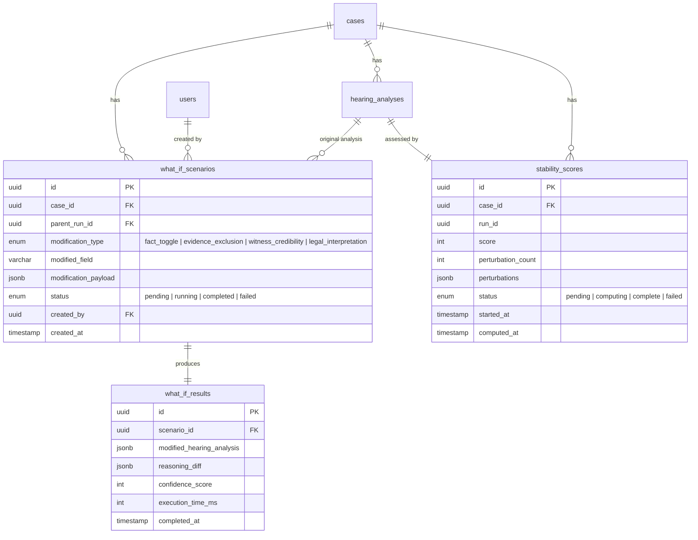
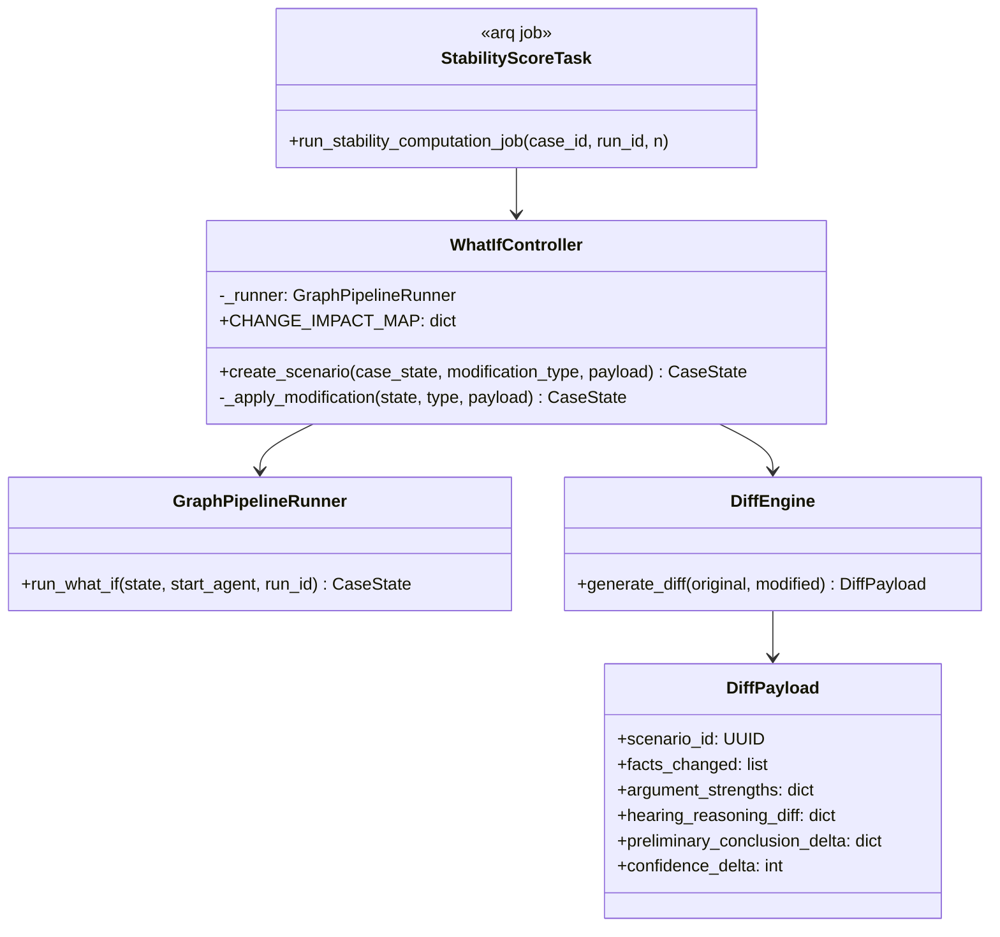

# Part 7: Contestable Judgment Mode

---

## 7.1 Overview

The Contestable Judgment Mode transforms VerdictCouncil from a static recommendation engine into an **interactive judicial simulator**. After receiving an initial hearing analysis and fairness audit, the presiding judge can manipulate the underlying inputs and observe how the outcome changes in near-real-time — without the system ever producing a binding verdict.

| Modification | Description | Example |
|---|---|---|
| **Fact toggle** | Flip a fact from "agreed" to "disputed" or vice versa | Toggle whether the defendant was present at the scene |
| **Evidence exclusion / inclusion** | Remove or restore a specific exhibit from consideration | Exclude a contested CCTV recording |
| **Witness credibility adjustment** | Up-rank or down-rank a witness's credibility score | Reduce credibility of a witness with prior perjury |
| **Legal interpretation change** | Substitute an alternative interpretation of a statutory provision | Apply a narrow reading of a section |

The system re-runs **only the downstream agents** affected by the change, producing an updated hearing analysis alongside a structured diff view. The original analysis is always preserved; what-if variants are stored as separate, linked records.

This serves two judicial needs:

1. **Pre-hearing stress testing** — the judge explores whether the preliminary conclusion is robust before convening the hearing.
2. **Appellate reasoning support** — the judge can document that even under alternative assumptions, the outcome holds (or identify precisely which facts are dispositive).

No AI verdict is ever generated. The judge remains the decision-maker at Gate 4.

---

## 7.2 What-If Re-Execution Engine

### 7.2.1 Architecture

The **What-If Controller** (`src/services/whatif_controller/controller.py`) drives re-execution. It runs in-process inside the arq worker, deep-clones the completed `CaseState`, applies the modification, and invokes the existing LangGraph pipeline with a `start_agent` override — the graph's conditional entry edge routes directly to the chosen re-entry node.

```
Judge ─▶ FastAPI /what-if
           │
           ▼
      pipeline_jobs (outbox) ─▶ Redis (arq)
                                      │
                                      ▼
                              arq worker
                                      │
                                      ▼
                         WhatIfController
                                      │
                            ┌─────────┴─────────┐
                            ▼                   ▼
                   _apply_modification    clone CaseState,
                                          assign new run_id,
                                          parent_run_id = origin
                                      │
                                      ▼
                         GraphPipelineRunner.run_what_if(start_agent=…)
                                      │
                                      ▼
                          LangGraph re-entry → … → terminal
                                      │
                                      ▼
                            DiffEngine.generate_diff
                                      │
                                      ▼
                            what_if_scenarios / what_if_results
                                      │
                                      ▼
                             SSE push ─▶ Judge
```

**Key property:** the downstream agents are unaware they are in a what-if run. They receive the mutated `CaseState` as their input, write to the same typed fields, and append to the same `audit_log`. Telemetry distinguishes what-if runs via `CaseState.parent_run_id`.

### 7.2.2 Change Impact Mapping

The canonical map lives in `WhatIfController.CHANGE_IMPACT_MAP`. Each modification re-enters at the earliest agent that **owns** the field being mutated — going further downstream would skip the owner and leave the mutation unprocessed.

| Modification Type | Re-execution Start | Re-run Sequence | Rationale |
|---|---|---|---|
| `fact_toggle` | `argument-construction` | arguments → hearing-analysis → hearing-governance | Facts live in `extracted_facts`; `argument-construction` reads them first |
| `evidence_exclusion` | `evidence-analysis` | full Gate-2 → argument-construction → hearing-analysis → hearing-governance | Exclusion changes the evidentiary foundation; Gate-2 must re-compose |
| `witness_credibility` | `witness-analysis` | witness-analysis → join → argument-construction → hearing-analysis → hearing-governance | Credibility lives in `witnesses`, owned by `witness-analysis`; re-entering later would leave the mutation unprocessed |
| `legal_interpretation` | `legal-knowledge` | legal-knowledge → join → argument-construction → hearing-analysis → hearing-governance | Interpretive shifts require fresh statute + precedent retrieval before argument construction |

### 7.2.3 CaseState Mutation

1. Deep-clone the completed `CaseState` via `CaseState(**copy.deepcopy(state.model_dump()))`.
2. `_apply_modification(cloned, modification_type, payload)` writes the change into the cloned state. Each modification type has a matching helper (e.g. `_toggle_fact_status`, `_exclude_evidence_item`, `_adjust_witness_credibility`).
3. Assign a new `run_id`; set `parent_run_id` to the origin run's id so the checkpoint + MLflow lineage is traceable.
4. Invoke `GraphPipelineRunner.run_what_if(state, start_agent=..., run_id=...)`. The graph's conditional entry edge (after `pre_run_guardrail`) routes to the chosen node; upstream nodes are skipped.

### 7.2.4 Checkpoint-backed resume (not short-circuit caching)

The pre-SAM design used Redis-keyed "short-circuit caching" as a fallback. The LangGraph design makes that unnecessary: `AsyncPostgresSaver` already checkpoints the completed run, and `start_agent` re-entry reads the checkpoint without the earlier agents touching the LLM. Cached mid-pipeline results are an implementation detail of the checkpointer, not a separate mechanism.

---

## 7.3 Verdict Stability Score

### 7.3.1 Method

Systematically perturb the case inputs and observe whether the preliminary conclusion holds:

| Mode | Description | When Used |
|---|---|---|
| **Sampled (default)** | Top N=5 perturbations ranked by the importance weight the `hearing-analysis` reasoning chain placed on each fact / piece of evidence | Default for all cases |
| **Exhaustive** | Toggle every binary fact and exclude every exhibit, one at a time | On explicit judge request; cases with ≤ 15 toggleable inputs |

Perturbations are enqueued as `run_whatif_scenario_job` tasks (see `src/workers/tasks.py`) so the arq worker pool runs them concurrently rather than in series.

### 7.3.2 Formula

```
stability_score = (perturbations_where_conclusion_holds / N) × 100
```

| Score Range | Classification | Judicial Guidance |
|---|---|---|
| 85–100 | **Stable** | Preliminary conclusion is robust. Strong basis for judgment. |
| 60–84 | **Moderately sensitive** | Holds in most scenarios but is sensitive to specific inputs. |
| 0–59 | **Highly sensitive** | Changes under multiple perturbations. Heightened scrutiny warranted. |

> **Score Calibration Disclaimer:** All numerical scores in VerdictCouncil (credibility scores from `witness-analysis`, confidence scores from `hearing-analysis`, stability scores from what-if) are relative indicators produced by LLM reasoning, not statistically calibrated measurements. Treat them as directional signals (higher = stronger support), not probabilities. Judges should treat them as one input among many, not as determinative.

### 7.3.3 Execution Model

Computed **asynchronously** via arq:

1. Initial `hearing-analysis` result is returned to the judge immediately.
2. Judge clicks "Assess Stability" (or auto-triggers per configuration).
3. API enqueues `run_stability_computation_job(case_id, run_id, n)`.
4. The stability task enqueues N `run_whatif_scenario_job` children; arq runs them with up to `max_jobs=10` concurrency.
5. Each perturbation writes its result; the stability task blocks on their completion, aggregates, and writes the final score.
6. SSE updates the frontend as perturbations finish. Results populate within 2–3 minutes.

### 7.3.4 Cost

Rough per-perturbation cost (fact / credibility / legal — re-runs `argument-construction`, `hearing-analysis`, `hearing-governance`, all frontier tier):

| Component | Per Run | N=5 Total |
|---|---|---|
| `argument-construction` (gpt-5.4) | ~$1.05 | $5.25 |
| `hearing-analysis` (gpt-5.4) | ~$1.13 | $5.65 |
| `hearing-governance` (gpt-5.4) | ~$0.70 | $3.50 |
| **Total** | **~$2.88** | **~$14.40** |

`evidence_exclusion` is more expensive because it re-runs all four Gate-2 agents on top; budget approximately 2× the above for that modification type.

---

## 7.4 Diff View

Structured before/after comparison produced by `src/services/whatif_controller/diff_engine.py`:

| Component | Display |
|---|---|
| **Fact status** | Changed facts highlighted with old → new status |
| **Evidence items** | Excluded items with strikethrough; included with addition marker |
| **Argument strengths** | Side-by-side percentage bars with delta (Δ%) |
| **Hearing reasoning chain** | Inline diff (additions green, removals red) |
| **Preliminary conclusion** | Bold indicator if conclusion changed |
| **Confidence score** | Score with delta (Δ%) |
| **Fairness check delta** | New `critical_issues_found` flags highlighted |

---

## 7.5 Latency Budget

| Scenario | Re-run nodes | Target Latency |
|---|---|---|
| Fact / witness-credibility / legal change | `argument-construction` → `hearing-analysis` → `hearing-governance` (and for witness/legal: the owning Gate-2 agent first) | **≤ 45s** |
| Evidence exclusion | `evidence-analysis` (+ parallel Gate-2) → `argument-construction` → `hearing-analysis` → `hearing-governance` | **≤ 60s** |
| Stability score (N=5, parallel) | 5 × downstream path | **≤ 180s (async)** |

The arq worker's `job_timeout` is set to 900s (`src/workers/worker_settings.py`) as an upper bound; the targets above are what we expect under normal conditions.

---

## 7.6 User Stories

### US-031: Toggle Facts in What-If Mode

**Actor:** Tribunal Magistrate / Judge

As a judicial officer reviewing a completed case analysis, I want to toggle a fact between "agreed" and "disputed" and see how the preliminary conclusion changes, so that I can assess whether the conclusion is sensitive to that specific factual finding.

**Acceptance Criteria:**

- A "What-If Mode" toggle is visible on completed case views.
- Judge can click any binary fact to toggle its status with a visual indicator.
- Clicking "Re-analyse" re-runs the downstream pipeline with the modified `CaseState` and shows agent-level progress over SSE.
- Diff view shows argument strength deltas, hearing reasoning diffs, preliminary conclusion comparison.
- Original run is preserved alongside the what-if variant (`parent_run_id` set).
- What-if scenario is persisted with full audit trail (modification type, payload, timestamps, user ID).
- Judge can cancel an in-progress re-analysis.

**Happy Flow:**

1. Judge opens a completed case from the case list.
2. Judge clicks "What-If Mode" in the case toolbar.
3. Facts, evidence, and witness credibility scores become interactive/editable.
4. Judge clicks on Fact F-003 ("Defendant was present at the scene") — status toggles from "agreed" to "disputed."
5. Judge clicks "Re-analyse."
6. SSE progress: "Re-running argument-construction…" → "Re-running hearing-analysis…" → "Re-running hearing-governance…".
7. Diff view appears: Prosecution 72% → 65% (Δ-7%), Defence 58% → 64% (Δ+6%), preliminary conclusion flips, confidence 78% → 54% (Δ-24%).
8. Judge reviews the diff, saves the what-if scenario for the case record.

**Domain Notes:**

- SCT: Facts classified as "agreed" (undisputed) or "disputed" (contested). Toggling simulates how the case resolves under alternative factual assumptions.
- Traffic: Toggling facts related to specific charges may affect multiple charge outcomes.

---

### US-032: View Verdict Stability Score

**Actor:** Tribunal Magistrate / Judge

As a judicial officer who has received a preliminary conclusion, I want to see a stability score indicating how robust it is across perturbations, so that I can gauge whether it is reliable or finely balanced.

**Acceptance Criteria:**

- "Assess Stability" button visible on completed hearing-analysis summaries.
- Progress indicator shows perturbation completion (e.g., "2/5 complete").
- Score displayed as 0–100 with classification label and colour coding (green/amber/red).
- Breakdown view shows each perturbation: what changed, whether the conclusion held, confidence score.
- Judge can drill into any perturbation to see its full diff view.
- Stability computation does not block the judge from reviewing the original analysis.
- Computed score is persisted and does not require recomputation.

**Happy Flow:**

1. Judge reviews initial hearing analysis for Case C-2025-0042.
2. Judge clicks "Assess Stability."
3. System acknowledges: "Computing stability score… This will take 2–3 minutes."
4. Progress indicator: "Perturbation 1/5: toggling Fact F-003…"
5. After ~30s: "1/5 complete. Conclusion held."
6. Judge continues reading detailed reasoning while perturbations run.
7. After ~150s, all 5 perturbations complete.
8. Stability score appears: **80/100 — Moderately Sensitive** (amber).
9. Judge clicks the score for breakdown: P1 held (71%), P2 **flipped** (52%), P3 held (74%), P4 held (68%), P5 held (76%).
10. Judge clicks P2 to see full diff view — Exhibit E-007 (CCTV footage) is dispositive.
11. Judge uses this insight to focus oral submissions on admissibility of E-007.

---

### US-033: Pipeline Replay (View Agent Reasoning)

**Actor:** Tribunal Magistrate / Judge

As a judicial officer reviewing a case, I want to inspect the reasoning of each individual agent in the pipeline, so that I can understand why the system reached its conclusions and verify the logic at each step.

**Acceptance Criteria:**

- Pipeline view shows all nine reasoning agents in sequence with status indicators and execution times.
- Clicking any agent's node opens a detail panel showing: input payload, system prompt, tool calls, LLM response, structured output — all sourced from `CaseState.audit_log` and cross-referenced against MLflow.
- For what-if scenarios, only re-run agents show updated data; skipped agents display "Output unchanged (reused from run `<parent_run_id>`)".
- Judge can copy full input/output payload for external reference.
- Agent execution times displayed for bottleneck identification.

**Happy Flow:**

1. Judge opens Case C-2025-0042 and navigates to "Pipeline" tab.
2. Horizontal pipeline visualisation shows all nine agents with green checkmarks and execution times.
3. Judge clicks `hearing-analysis`.
4. Detail panel opens with tabs: Input, Prompt, Reasoning, Output.
5. Judge reads the reasoning, noting heavy weighting of CCTV evidence.
6. Judge clicks "Copy Output" for written grounds of decision.
7. Judge navigates to `evidence-analysis` to verify the initial CCTV assessment.

---

## 7.7 Data Model Extensions

### ERD additions



The canonical schema lives in `alembic/versions/` — treat this diagram as a logical view.

---

## 7.8 Sequence Diagram: What-If Mode

```mermaid
sequenceDiagram
    actor Judge
    participant API as FastAPI
    participant PG as PostgreSQL
    participant RQ as Redis (arq)
    participant W as arq worker
    participant WIC as WhatIfController
    participant GR as GraphPipelineRunner
    participant AC as argument-construction
    participant HA as hearing-analysis
    participant HG as hearing-governance
    participant DE as DiffEngine

    Judge ->>+ API: POST /what-if {case_id, modification_type, payload}
    API ->> PG: load CaseState via pipeline_checkpoints
    API ->> PG: INSERT what_if_scenarios (status=pending)
    API ->> RQ: enqueue run_whatif_scenario_job(scenario_id)
    API -->>- Judge: 202 Accepted {scenario_id}

    RQ -->>+ W: dequeue
    W ->> PG: load original CaseState + scenario
    W ->> WIC: create_scenario(state, modification_type, payload)
    WIC ->> WIC: deep-clone + _apply_modification + new run_id
    WIC ->> GR: run_what_if(state, start_agent=CHANGE_IMPACT_MAP[type])

    Note over GR,AC: For fact_toggle: start at argument-construction
    GR ->> AC: invoke
    AC -->> GR: partial state
    GR ->> PG: checkpoint
    Note over W,Judge: SSE: "argument-construction complete"

    GR ->> HA: hearing-analysis
    HA -->> GR: partial state
    GR ->> PG: checkpoint
    Note over W,Judge: SSE: "hearing-analysis complete"

    GR ->> HG: hearing-governance (Gate 4)
    HG -->> GR: fairness_check
    GR ->> PG: checkpoint
    Note over W,Judge: SSE: "hearing-governance complete"

    GR -->> WIC: modified CaseState
    WIC ->> DE: generate_diff(original, modified)
    DE -->> WIC: diff payload
    WIC ->> PG: INSERT what_if_results; UPDATE what_if_scenarios status=completed
    WIC -->>- W: done
    W -->> Judge: SSE: result + diff
```

For `evidence_exclusion`, the sequence begins at `evidence-analysis`; the four Gate-2 agents fan out in parallel, `gate2_join` merges, and the remainder matches the diagram above. For `witness_credibility`, substitute `witness-analysis`; for `legal_interpretation`, `legal-knowledge`.

---

## 7.9 What-If Controller

The controller is a plain in-process service. It does not subscribe to any broker, does not own its own pods, and does not spawn subprocesses — it's a class the arq worker instantiates per job.



Canonical implementation:

| Concern | File |
|---|---|
| Controller class | `src/services/whatif_controller/controller.py` |
| Diff engine | `src/services/whatif_controller/diff_engine.py` |
| Graph entry point | `src/pipeline/graph/runner.py::GraphPipelineRunner.run_what_if` |
| arq jobs | `src/workers/tasks.py::run_whatif_scenario_job`, `run_stability_computation_job` |
| API routes | `src/api/routes/what_if.py` |
| Data models | `src/models/what_if.py` |

---

## 7.10 Running What-If Locally

Local development uses the same runtime as production — one API process + one arq worker — both invoking the same LangGraph graph in-process. Infrastructure (Postgres, Redis, optional MLflow) is provided by `docker-compose.infra.yml`.

```bash
# One-time
make install                                # uv sync + npm install equivalents
docker compose -f docker-compose.infra.yml up -d

# Start API + worker together (honcho)
make dev                                    # honcho -f Procfile.dev start

# Or individually
.venv/bin/uvicorn src.api.app:app --port 8001 --reload
.venv/bin/arq src.workers.worker_settings.WorkerSettings
```

To exercise a what-if run end-to-end in dev:

1. Submit a case via `POST /api/v1/cases`.
2. Wait for the pipeline to reach `ready_for_review` (via SSE or `GET /api/v1/cases/{id}`).
3. `POST /api/v1/what-if` with `{case_id, modification_type, modification_payload}`.
4. Watch the SSE stream or poll `GET /api/v1/what-if/{scenario_id}`.

`dev.sh` runs `python -m scripts.seed_users` automatically to create the demo login accounts (judge + admin). The rich demo fixtures (one traffic-violation case — *PP v Ahmad bin Ismail* — and one SCT case, with full pipeline output and pre-loaded domain KB documents) are created by `python -m scripts.fix_demo_data`, which is **not** run automatically — invoke it manually after the stack is up if you want them.

---

## Appendix D: Evaluation Framework

### D.1 Purpose

The evaluation framework defines curated test cases with known expected outcomes, enabling the team to verify that VerdictCouncil produces correct, grounded, and well-reasoned analyses. Each test case specifies the input documents, expected agent outputs at each pipeline stage, and the expected preliminary conclusion. This serves as a gold set for regression testing and demo validation.

### D.2 Evaluation Dimensions

| Dimension | What It Measures | Target | How Measured |
|---|---|---|---|
| **Extraction accuracy** | Are facts, parties, and evidence correctly extracted from documents? | 95%+ of facts extracted with correct source citations | Manual comparison against ground truth per test case |
| **Retrieval precision** | Do the retrieved statutes and precedents match the expected legal provisions? | 80%+ of expected statutes retrieved in top-10 results | Expected statutes list vs `legal-knowledge` output |
| **Citation grounding** | Are all cited statutes and precedents real (no hallucinations)? | 100% verifiable citations | Every citation cross-checked against vector store or PAIR search results |
| **Reasoning soundness** | Does the hearing reasoning follow logically from evidence to conclusion? | No unsupported logical leaps in the reasoning chain | Manual review of `hearing-analysis` reasoning chain |
| **Conclusion alignment** | Does the preliminary conclusion match the expected outcome for the test case? | Correct conclusion in all 3 test cases | Direct comparison: expected vs actual |
| **Fairness audit** | Does `hearing-governance` correctly flag planted biases and pass clean cases? | 100% detection of planted biases, 0% false positives on clean cases | Binary check per test case |
| **What-if sensitivity** | Does toggling the dispositive fact produce the expected conclusion flip? | Correct flip in all cases where one is expected | Toggle dispositive fact, check conclusion change |

### D.3 Test Case 1: Traffic Speeding (Straightforward Conviction)

**Case ID:** EVAL-TRAFFIC-001
**Domain:** Traffic Violation
**Complexity:** Low
**Expected Outcome:** Guilty — fine $800, 6 demerit points

#### Input Documents

| Document | Type | Party | Description |
|---|---|---|---|
| `charge-sheet-001.pdf` | Charge sheet | Prosecution | Speeding charge: 92 km/h in 70 km/h zone on PIE, 14 March 2025, 2:35 AM |
| `speed-camera-report.pdf` | Evidence | Prosecution | Calibrated speed camera report: device ID SC-4421, last calibrated 2025-01-10, speed recorded 92 km/h, photo of vehicle with licence plate SGX1234A |
| `accused-statement.pdf` | Statement | Defence | Accused admits driving the vehicle, disputes speed reading, claims camera may be inaccurate, no supporting evidence for dispute |
| `driving-record.pdf` | Evidence | Prosecution | Clean driving record, no prior offences in 10 years |

#### Expected Pipeline Outputs

| Agent | Key Expected Outputs |
|---|---|
| `case-processing` | Domain: traffic_violation. Offence: speeding (s 63(1) RTA). Jurisdiction: valid. |
| `complexity-routing` | Complexity: low. Route: proceed_automated. |
| `evidence-analysis` | Speed camera report: strong (calibrated, recent certification). Accused statement: weak (disputes without evidence). |
| `fact-reconstruction` | Timeline: single event, 14 Mar 2025 02:35. Disputed: speed reading accuracy. Agreed: accused was driving. |
| `witness-analysis` | No witnesses. Credibility of accused statement: 35/100 (disputes calibrated equipment without evidence). |
| `legal-knowledge` | s 63(1) RTA: exceeding speed limit. s 131(2) RTA: penalties. Precedents: PP v Lim [2024] (similar speed, $700 fine). |
| `argument-construction` | Prosecution strength: 85%. Defence strength: 25%. Weakness: accused's dispute is unsupported. |
| `hearing-analysis` | Established: accused drove at 92 km/h in 70 km/h zone. Camera calibrated. Dispute without evidence. Preliminary conclusion: guilty. |
| `hearing-governance` | Fairness: PASS. Preliminary outcome: guilty. Suggested sentence range: $600–1000 fine, 6 demerit points. Confidence: 88%. |

#### What-If Test

| Toggle | Expected Result |
|---|---|
| Exclude speed camera report | Conclusion flips to NOT GUILTY (no evidence of speed). Stability drops to 0%. |
| Toggle "accused was driving" to disputed | Conclusion flips to NOT GUILTY (identity not established). |
| Change accused credibility to 80/100 | Conclusion remains GUILTY but confidence drops to 65%. Speed camera evidence still dispositive. |

---

### D.4 Test Case 2: Traffic Red Light (Contested, Multiple Witnesses)

**Case ID:** EVAL-TRAFFIC-002
**Domain:** Traffic Violation
**Complexity:** Medium
**Expected Outcome:** Guilty — fine $400, 12 demerit points

#### Input Documents

| Document | Type | Party | Description |
|---|---|---|---|
| `charge-sheet-002.pdf` | Charge sheet | Prosecution | Red light violation: junction of Orchard Rd and Scotts Rd, 28 Feb 2025, 6:15 PM |
| `red-light-camera.pdf` | Evidence | Prosecution | Red light camera report: signal was red for 1.8 seconds when vehicle crossed stop line. Photo shows vehicle SGY5678B mid-junction. |
| `witness-statement-officer.pdf` | Statement | Prosecution | Traffic Police officer Sgt Tan: was stationed at junction, observed vehicle crossing after signal turned red, noted approximately 2 seconds into red phase. |
| `witness-statement-passenger.pdf` | Statement | Defence | Passenger Mr Lee: "The light was amber when we entered the junction. It turned red while we were already crossing." |
| `accused-statement-002.pdf` | Statement | Defence | Accused: "The light turned amber as I approached. I was too close to stop safely. I entered on amber but it changed to red during my crossing." |
| `junction-diagram.pdf` | Evidence | Prosecution | Traffic Police junction diagram showing camera position, stop line, and vehicle trajectory. |

#### Expected Pipeline Outputs

| Agent | Key Expected Outputs |
|---|---|
| `case-processing` | Domain: traffic_violation. Offence: red light violation (s 120(1)(a) RTA r/w Rule 8 RTR). Jurisdiction: valid. |
| `complexity-routing` | Complexity: medium. Route: proceed_with_review. (Multiple witnesses, factual dispute.) |
| `evidence-analysis` | Camera report: strong (1.8s into red is clear violation). Officer statement: medium (corroborates camera but estimated timing). Passenger statement: weak (interested party, contradicts camera data). |
| `fact-reconstruction` | Disputed: whether vehicle entered junction on amber or red. Camera data says 1.8s red. Defence says amber entry. |
| `witness-analysis` | Sgt Tan: credibility 75/100 (corroborates camera, slight timing variance). Mr Lee: credibility 40/100 (interested party, contradicts objective evidence). |
| `legal-knowledge` | s 120(1)(a) RTA: failing to conform to traffic signals. Rule 8 RTR: red signal means stop. Precedent: PP v Wong [2023] (1.5s red, $350 fine, 12 demerit). |
| `argument-construction` | Prosecution: 78%. Defence: 35%. Key weakness for defence: camera data is objective, passenger testimony is subjective and contradicted by mechanical evidence. |
| `hearing-analysis` | Camera data is dispositive. 1.8s is well past the amber-to-red transition. Defence argument of "entered on amber" contradicted by camera timestamp. |
| `hearing-governance` | Fairness: PASS. Preliminary outcome: guilty. Suggested sentence: $400 fine, 12 demerit points. Confidence: 82%. |

#### What-If Test

| Toggle | Expected Result |
|---|---|
| Exclude red light camera report | Conclusion becomes uncertain. Officer vs passenger testimony. Confidence drops to 55%. May flip to NOT GUILTY. |
| Increase passenger credibility to 80/100 | Conclusion remains GUILTY (camera data still dispositive) but confidence drops to 70%. |
| Toggle camera timing from 1.8s to 0.3s | Conclusion likely flips — 0.3s is within amber-to-red transition. Defence argument of "entered on amber" becomes plausible. |

---

### D.5 Test Case 3: SCT Sale of Goods (Balanced Dispute)

**Case ID:** EVAL-SCT-001
**Domain:** Small Claims Tribunal
**Complexity:** Medium
**Expected Outcome:** Partial compensation — $3,500 of $5,000 claimed

#### Input Documents

| Document | Type | Party | Description |
|---|---|---|---|
| `claim-form.pdf` | Filing | Claimant | Sarah Lim claims $5,000 for defective custom furniture. Ordered custom dining table and 6 chairs on 15 Jan 2025 for $5,000. Delivered 20 Feb 2025. Table has visible warping and 2 chairs have uneven legs. |
| `contract-invoice.pdf` | Evidence | Claimant | Invoice from Woodcraft Pte Ltd: "Custom dining set — solid teak, 8-seater table + 6 chairs. $5,000. Delivery: 4-6 weeks." |
| `photos-defects.zip` | Evidence | Claimant | 12 photos showing: table surface warping (3 photos), chair leg unevenness (4 photos), overall set (5 photos). |
| `response-form.pdf` | Filing | Respondent | Woodcraft Pte Ltd (Mr David Tan, director) responds: admits warping on table but claims it is within normal range for solid teak (wood expands/contracts with humidity). Denies chair defects — says chairs were level when delivered and customer may have damaged them. |
| `woodcraft-warranty.pdf` | Evidence | Respondent | Warranty card: "12-month warranty against manufacturing defects. Normal wood movement (expansion/contraction up to 3mm) is not a defect." |
| `independent-assessment.pdf` | Evidence | Claimant | Assessment by furniture inspector Mr Ahmad: "Table warping exceeds 8mm in centre — beyond normal wood movement. 2 of 6 chairs have measurable leg length discrepancy of 4-5mm, consistent with manufacturing defect, not user damage." |

#### Expected Pipeline Outputs

| Agent | Key Expected Outputs |
|---|---|
| `case-processing` | Domain: small_claims. Category: sale_of_goods. Claim: $5,000. Jurisdiction: valid (under $20,000, within 2 years). |
| `complexity-routing` | Complexity: medium. Route: proceed_with_review. (Expert evidence, competing factual claims.) |
| `evidence-analysis` | Photos: medium (show defects but severity debatable). Independent assessment: strong (objective, expert, quantified). Warranty: medium (relevant but narrow scope). |
| `fact-reconstruction` | Agreed: contract existed, $5,000 paid, furniture delivered 20 Feb 2025. Disputed: whether warping exceeds normal range, whether chairs were defective at delivery. |
| `witness-analysis` | No formal witnesses. Claimant credibility: 70/100 (consistent, supported by independent assessment). Respondent credibility: 55/100 (admits table warping but disputes severity, denies chair defects against expert finding). |
| `legal-knowledge` | s 13 SOGA: implied condition of satisfactory quality. s 14 SOGA: fitness for purpose. s 35 SCTA: tribunal may order repair, replacement, or refund. Precedent: Tan v Furniture World [2024] (similar defect, partial refund awarded). |
| `argument-construction` | Claimant: 65%. Respondent: 45%. Table warping (8mm) clearly exceeds warranty's 3mm threshold. Chair defects supported by independent expert against respondent's denial. Respondent's weakness: warranty threshold contradicts their own position. |
| `hearing-analysis` | Table: defective (8mm > 3mm warranty threshold). Chairs: 2 of 6 defective per expert. 4 chairs acceptable. Partial compensation appropriate — not full refund since 4 chairs and overall set are usable. |
| `hearing-governance` | Fairness: PASS. Preliminary outcome: partial compensation $3,500 (table replacement cost $2,500 + 2 defective chairs at $500 each). Confidence: 72%. Alternative: full refund $5,000 if tribunal finds set is not fit for purpose as a whole. |

#### What-If Test

| Toggle | Expected Result |
|---|---|
| Exclude independent assessment | Claimant strength drops. Conclusion may reduce to $2,000 (table only, based on photos). Chair claim becomes "he said / she said." |
| Toggle "warranty 3mm threshold" fact to disputed | Respondent's position strengthens. Conclusion may reduce — warping is contested. |
| Toggle chair defects to "agreed" | Conclusion increases to full $5,000 — both table and all disputed chairs are now conceded as defective. |

---

### D.6 Evaluation Execution Protocol

1. **Before demo:** Run all 3 test cases through the full pipeline. Verify each agent's output against the expected outputs table. Flag any discrepancies.
2. **During demo:** Use EVAL-TRAFFIC-001 (simplest case) for the live pipeline demo. Use EVAL-TRAFFIC-002 for the what-if toggle demo (exclude camera report to show conclusion flip).
3. **After implementation changes:** Re-run all 3 test cases as regression tests. Any deviation from expected outputs must be investigated and either accepted (with updated expectations) or fixed.

### D.7 Hallucination Detection Checklist

For each test case run, verify:

- [ ] All cited statute sections exist in the domain vector store (cross-reference via `search_domain_guidance`).
- [ ] All cited precedent cases exist in PAIR or in the curated fallback vector store.
- [ ] No statute section numbers are fabricated (compare against actual Act text).
- [ ] No precedent citations reference non-existent cases.
- [ ] Confidence scores are consistent with evidence strength (strong evidence should not produce low confidence).
